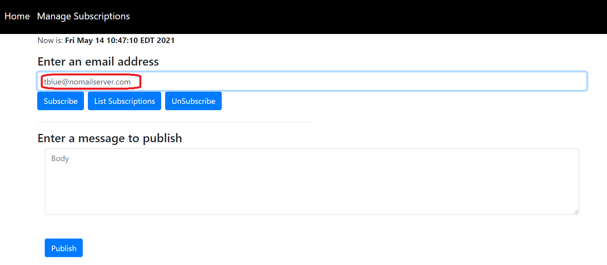
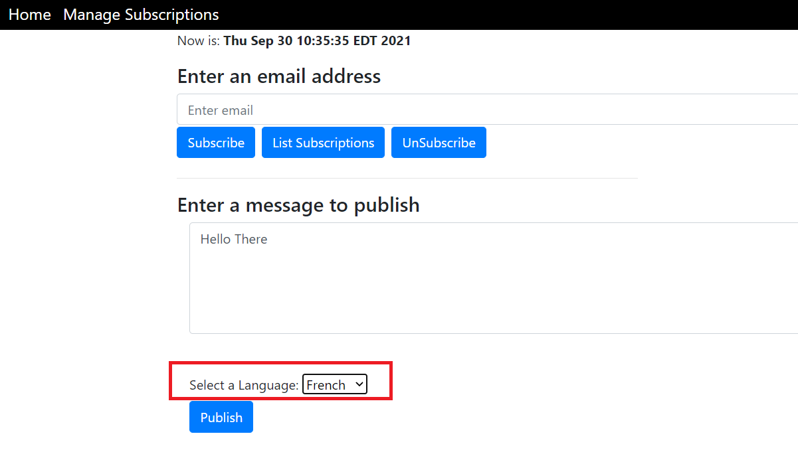
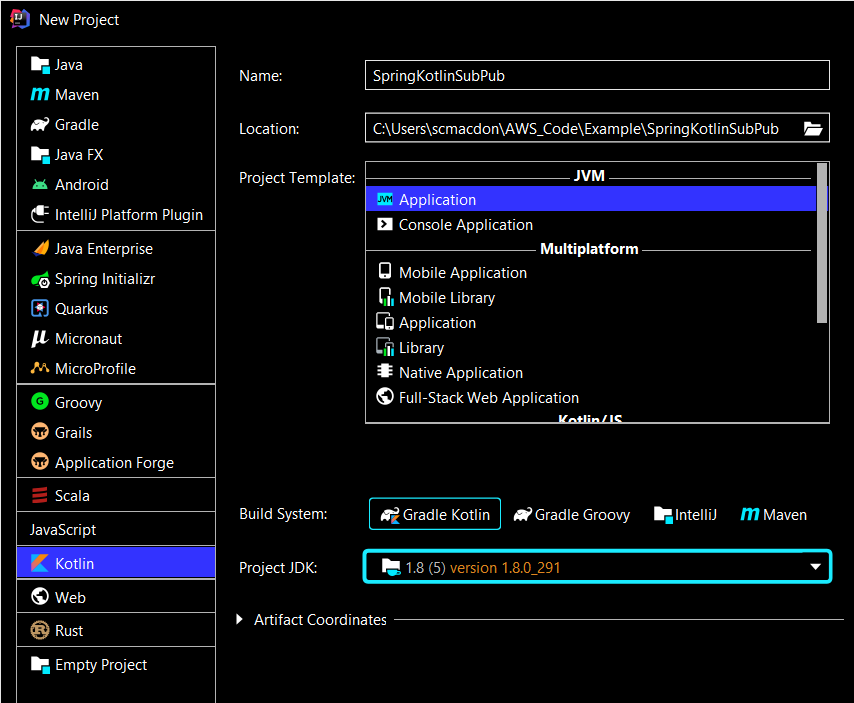
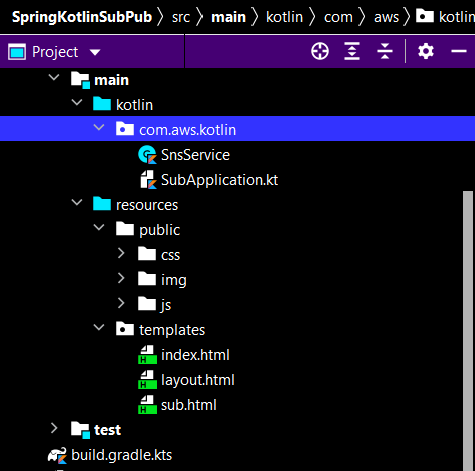
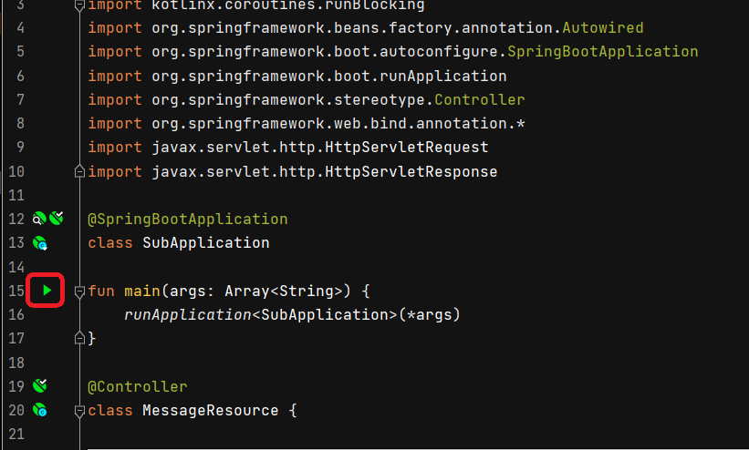

# Create a publish/subscription web application that translates messages using the AWS SDK for Kotlin

## Purpose
You can create a web application that has subscription and publish functionality by using the Amazon Simple Notification Service (Amazon SNS) and the AWS SDK for Kotlin. The application created in this AWS tutorial is a Spring Boot web application that lets a user subscribe to an Amazon SNS topic by entering a valid email address. A user can enter many emails and all of them are subscribed to the given SNS topic (once the email recipients confirm the subscription). The user can publish a message that results in all subscribed emails receiving the message. 

**Note**: Amazon SNS is a managed service that provides message delivery from publishers to subscribers (also known as producers and consumers). For more information, see [What is Amazon SNS?](https://docs.aws.amazon.com/sns/latest/dg/welcome.html)

#### Topics

+ Prerequisites
+ Create an IntelliJ project 
+ Add the dependencies to your project
+ Create the Kotlin classes
+ Create the HTML files
+ Run the application

## Prerequisites

To complete the tutorial, you need the following:

+ An AWS account
+ A Java IDE (this tutorial uses the IntelliJ IDE)
+ Java JDK 1.8
+ Gradle 6.8 or higher

**Note**: Make sure that you have installed the Kotlin plug-in for IntelliJ. 

### Important

+ The AWS services included in this document are included in the [AWS Free Tier](https://aws.amazon.com/free/?all-free-tier.sort-by=item.additionalFields.SortRank&all-free-tier.sort-order=asc).
+  This code has not been tested in all AWS Regions. Some AWS services are available only in specific regions. For more information, see [AWS Regional Services](https://aws.amazon.com/about-aws/global-infrastructure/regional-product-services). 
+ Running this code might result in charges to your AWS account. 
+ Be sure to terminate all of the resources you create while going through this tutorial to ensure that you’re not charged.

### Creating the resources

Create an Amazon SNS topic that you use in the Kotlin code. For information, see [Creating an Amazon SNS topic](https://docs.aws.amazon.com/sns/latest/dg/sns-create-topic.html). 

## Understand the Publish/Subscription application

To subscribe to an Amazon SNS topic, the user enters a valid email address into the web application. 

The specified email address recieves an email message that lets the recipient confirm the subscription. 

Once the email recipient accepts the confirmation, that email is subscribed to the specific SNS topic and recieves published messages. To publish a message, a user enters the message into the web applicaiton and then chooses the **Publish** button. 

This application lets a user specify the language of the message that is sent. For example, the user can select **French** from the dropdown field and then the message appears in that language to all subscribed users. 

This example application lets you view all of the subscribed email recipients by choosing the **List Subscriptions** button, as shown in the following illustration.

## Create an IntelliJ project

The following figure shows the project options.

Perform these steps. 

1. In the IntelliJ IDE, choose **File**, **New**, **Project**.
2. In the **New Project** dialog box, choose **Kotlin**.
3. Enter the name **SpringKotlinSubPub**. 
4. Select **Gradle Kotlin** for the Build System.
5. Select your JVM option and choose **Next**.
6. Choose **Finish**.

## Add the Spring POM dependencies to your project

At this point, you have a new project named **SpringKotlinSubPub**. Ensure that the gradle build  file resembles the following code.

     import org.jetbrains.kotlin.gradle.tasks.KotlinCompile

     plugins {
      id("org.springframework.boot") version "2.5.2"
      id("io.spring.dependency-management") version "1.0.11.RELEASE"
      kotlin("jvm") version "1.5.20"
      kotlin("plugin.spring") version "1.5.20"
      }

     group = "com.example"
     version = "0.0.1-SNAPSHOT"
     java.sourceCompatibility = JavaVersion.VERSION_1_8

    repositories {
     mavenCentral()
     mavenLocal()
    }

    dependencies {
     implementation("org.springframework.boot:spring-boot-starter-thymeleaf")
     implementation("org.springframework.boot:spring-boot-starter-web")
     implementation("com.fasterxml.jackson.module:jackson-module-kotlin")
     implementation("org.jetbrains.kotlin:kotlin-reflect")
     implementation("org.jetbrains.kotlin:kotlin-stdlib-jdk8")
     implementation ("javax.mail:javax.mail-api:1.5.5")
     implementation ("com.sun.mail:javax.mail:1.5.5")
     implementation("aws.sdk.kotlin:sns:0.9.0-alpha")
     implementation("aws.sdk.kotlin:translate:0.9.0-alpha")
     testImplementation("org.springframework.boot:spring-boot-starter-test")
     }

     tasks.withType<KotlinCompile> {
      kotlinOptions {
        freeCompilerArgs = listOf("-Xjsr305=strict")
        jvmTarget = "1.8"
      }
     }

    tasks.withType<Test> {
     useJUnitPlatform()
    }
     
 ## Create the Kotlin classes
 
 Create a package in the main/kotlin folder named **com.aws.kotlin**. The Kotlin classes go into this package. 
 
 
 
 Create these Java classes:

+ **SubApplication** - Used as the base class for the Spring Boot application.
+ **MessageResource** - Used as the Spring Boot controller that handles HTTP requests. 
+ **SnsService** - Used to invoke Amazon SNS operations by using the Amazon SNS Kotlin API.  

**Note:** The **MessageResource** class is located in the **SubApplication** file.

### SubApplication class

The following Kotlin code represents the **SubApplication** and the **MessageResource** classes. Notice that the **SubApplication** uses the **@SpringBootApplication** annotation while the **MessageResource** class uses the **@Controller** annotation. In addition, the Spring Controller uses **runBlocking** and **@runBlocking**. Both are required and part of Kotlin Coroutine functionality. For more information, see [Coroutines basics](https://kotlinlang.org/docs/coroutines-basics.html).  

     package com.aws.kotlin

     import kotlinx.coroutines.runBlocking
     import org.springframework.beans.factory.annotation.Autowired
     import org.springframework.boot.autoconfigure.SpringBootApplication
     import org.springframework.boot.runApplication
     import org.springframework.stereotype.Controller
     import org.springframework.web.bind.annotation.*
     import javax.servlet.http.HttpServletRequest
     import javax.servlet.http.HttpServletResponse

     @SpringBootApplication
     class SubApplication

     fun main(args: Array<String>) {
      runApplication<SubApplication>(*args)
    }

    @Controller
    class MessageResource {

    @Autowired
    var sns: SnsService? = null

    @GetMapping("/")
    fun root(): String? {
        return "index"
    }

    @GetMapping("/subscribe")
    fun add(): String? {
        return "sub"
    }

    @RequestMapping(value = ["/delSub"], method = [RequestMethod.POST])
    @ResponseBody
    fun delSub(request: HttpServletRequest, response: HttpServletResponse?): String? = runBlocking {
        val email = request.getParameter("email")
        sns?.unSubEmail(email)
        return@runBlocking "$email was successfully deleted!"
    }
  
    @RequestMapping(value = ["/addEmail"], method = [RequestMethod.POST])
    @ResponseBody
    fun addItems(request: HttpServletRequest, response: HttpServletResponse?): String? = runBlocking {
        val email = request.getParameter("email")
        return@runBlocking sns?.subEmail(email)
    }

    @RequestMapping(value = ["/addMessage"], method = [RequestMethod.POST])
    @ResponseBody
    fun addMessage(request: HttpServletRequest, response: HttpServletResponse?): String? = runBlocking {
        val body = request.getParameter("body")
        val lang = request.getParameter("lang")
        return@runBlocking sns?.pubTopic(body,lang)
    }

    @RequestMapping(value = ["/getSubs"], method = [RequestMethod.GET])
    @ResponseBody
    fun getSubs(request: HttpServletRequest?, response: HttpServletResponse?): String? = runBlocking{
        return@runBlocking sns?.getAllSubscriptions()
     }
    }

### SnsService class

The following Java code represents the **SnsService** class. This class uses the Java V2 SNS API to interact with Amazon SNS. For example, the **subEmail** method uses the email address to subscribe to the Amazon SNS topic. Likewise, the **unSubEmail** method unsubscibes from the Amazon SNS topic. The **pubTopic** publishes a message. 

     package com.aws.kotlin

     import org.springframework.stereotype.Component
     import aws.sdk.kotlin.services.sns.SnsClient
     import aws.sdk.kotlin.services.sns.model.*
     import org.w3c.dom.Document
     import java.io.StringWriter
     import javax.xml.parsers.DocumentBuilderFactory
     import javax.xml.parsers.ParserConfigurationException
     import javax.xml.transform.TransformerException
     import javax.xml.transform.TransformerFactory
     import javax.xml.transform.dom.DOMSource
     import javax.xml.transform.stream.StreamResult
     import kotlin.system.exitProcess

     @Component
     class SnsService {

    var topicArnVal = "<ENTER A TOPIC ARN>"

    private fun getClient(): SnsClient {

        val snsClient = SnsClient{ region = "us-west-2" }
        return snsClient
     }

     // Create a Subscription.
     suspend fun subEmail(email: String?): String? {

        val snsClient: SnsClient = getClient()
        try {

            val request = SubscribeRequest {
                protocol = "email"
                endpoint = email
                returnSubscriptionArn = true
                topicArn = topicArnVal
            }

            val result = snsClient.subscribe(request)
            return result.subscriptionArn

        } catch (e: SnsException) {
            println(e.message)
            snsClient.close()
            exitProcess(0)
        }
       }

    suspend fun pubTopic(messageVal: String, lang:String):String {

        val snsClient: SnsClient = getClient()
        var body: String

        val translateClient = TranslateClient {
            region = "us-west-2"
        }

        try {

            if (lang.compareTo("English") == 0) {
                body = messageVal

            } else if (lang.compareTo("French") == 0) {

                val textRequest = TranslateTextRequest {
                    sourceLanguageCode = "en"
                    targetLanguageCode = "fr"
                    text = messageVal
                }

                val textResponse = translateClient.translateText(textRequest)
                body = textResponse.translatedText.toString()
            } else {
                val textRequest = TranslateTextRequest {
                    sourceLanguageCode = "en"
                    targetLanguageCode = "es"
                    text = messageVal
                }

                val textResponse = translateClient.translateText(textRequest)
                body = textResponse.translatedText.toString()
            }

            val request = PublishRequest {
                message = body
                topicArn = topicArnVal
            }

            val result = snsClient.publish(request)
            return "{$result.messageId.toString()}  message sent successfully in $lang."

        } catch (e: SnsException) {
            println(e.message)
            snsClient.close()
            exitProcess(0)
        }
      }

     suspend fun unSubEmail(emailEndpoint: String) {
        val snsClient: SnsClient = getClient()
        try {
            val subscriptionArnVal = getTopicArnValue(emailEndpoint)

            val request = UnsubscribeRequest {
                subscriptionArn = subscriptionArnVal
            }

            snsClient.unsubscribe(request)

        } catch (e: SnsException) {
            println(e.message)
            snsClient.close()
            exitProcess(0)
        }
       }

      // Returns the Sub ARN based on the given endpoint
      suspend fun getTopicArnValue(endpoint: String): String? {
        val snsClient: SnsClient = getClient()
        try {
            var subArn = ""

            val request = ListSubscriptionsByTopicRequest {
                topicArn = topicArnVal
            }

            val result = snsClient.listSubscriptionsByTopic(request)
            val allSubs: List<Subscription>? = result.subscriptions
            if (allSubs != null) {
                for (sub in allSubs) {
                    if (sub.endpoint?.compareTo(endpoint) ==0 ) {
                        subArn = sub.subscriptionArn.toString()
                        return subArn
                    }
                }
            }
            return ""
        } catch (e: SnsException) {
            println(e.message)
            snsClient.close()
            exitProcess(0)
        }
    }

    suspend fun getAllSubscriptions(): String? {
        val subList = mutableListOf<String>()
        val snsClient: SnsClient = getClient()

        try {

            val request = ListSubscriptionsByTopicRequest {
                topicArn = topicArnVal
            }
            val result = snsClient.listSubscriptionsByTopic(request)
            val allSubs = result.subscriptions
            if (allSubs != null) {
                for (sub in allSubs) {
                    subList.add(sub.endpoint.toString())
                }
            }

            return convertToString(toXml(subList))
        } catch (e: SnsException) {
            println(e.message)
            snsClient.close()
            exitProcess(0)
        }
    }

    // Convert the list to XML to pass back to the view.
    private fun toXml(subsList: List<String>): Document? {
        try {
            val factory = DocumentBuilderFactory.newInstance()
            val builder = factory.newDocumentBuilder()
            val doc = builder.newDocument()

            // Start building the XML.
            val root = doc.createElement("Subs")
            doc.appendChild(root)

            // Iterate through the collection.
            for (sub in subsList) {
                val item = doc.createElement("Sub")
                root.appendChild(item)

                // Set email
                val email = doc.createElement("email")
                email.appendChild(doc.createTextNode(sub))
                item.appendChild(email)
            }
            return doc
        } catch (e: ParserConfigurationException) {
            e.printStackTrace()
        }
        return null
       }

     private fun convertToString(xml: Document?): String? {
        try {
            val transformer = TransformerFactory.newInstance().newTransformer()
            val result = StreamResult(StringWriter())
            val source = DOMSource(xml)
            transformer.transform(source, result)
            return result.writer.toString()
        } catch (ex: TransformerException) {
            ex.printStackTrace()
        }
        return null
      }
     }

**Note:** Make sure that you assign the SNS topic ARN to the **topicArn** data member. Otherwise, your code does not work. 

## Create the HTML file

At this point, you have created all of the Java files required for this example application. Now create HTML files that are required for the application's view. Under the resource folder, create a **templates** folder, and then create the following HTML files:

+ index.html
+ layout.html
+ sub.html

### index.html
The **index.html** file is the application's home view. 

    <!DOCTYPE html>
    <html xmlns:th="https://www.thymeleaf.org">
    <head>
     <meta charset="utf-8" />
     <meta http-equiv="X-UA-Compatible" content="IE=edge" />
     <meta name="viewport" content="width=device-width, initial-scale=1" />
     
     <link rel="stylesheet" th:href="|https://maxcdn.bootstrapcdn.com/bootstrap/4.5.2/css/bootstrap.min.css|"/>
     <link rel="stylesheet" href="../public/css/styles.css" th:href="@{/css/styles.css}" />
     <link rel="icon" href="../public/img/favicon.ico" th:href="@{/img/favicon.ico}" />

    <title>AWS Job Posting Example</title>
    </head> 

     <body>
     <header th:replace="layout :: site-header"/>
     

     <h3>Welcome to the Amazon Simple Notification Service example app</h3>
     
Now is: <b th:text="${execInfo.now.time}"></b>

     
The Amazon Simple Notification Service example uses multiple AWS Services and the Java V2 API. Perform these steps:

     <ol>
        <li>You can subscribe to a SNS topic by choosing the <i>Manage Subscriptions</i> menu item.</li>
        <li>Enter a valid email address and then choose <i>Subscribe</i>.</li>
        <li>The sample application subscribes to the endpoint by using the SNS Java API V2.</li>
        <li>You can view all the email addresses that have subscribed by choosing the <i>List Subscriptions</i> menu item.</li>
        <li>You can unSubscribe by entering the email address and choosing <i>UnSubscribe</i>. </li>
        <li>You can publish a message by entering a message and choosing <i>Publish</i>.
        <li>All subscribed email recipients will receive the published message.</li>
       </ol>
      

     </body>
    </html>

### layout.html
The following code represents the **layout.html** file that represents the application's menu.

      <!DOCTYPE html>
      <html xmlns:th="http://www.thymeleaf.org">
     <head th:fragment="site-head">
     <meta charset="UTF-8" />
     <link rel="icon" href="../public/img/favicon.ico" th:href="@{/img/favicon.ico}" />
     
     <meta th:include="this :: head" th:remove="tag"/>
    </head>
    <header th:fragment="site-header">
     
     <a href="#" style="color: white" th:href="@{/}">Home</a>
     <a href="#" style="color: white" th:href="@{/subscribe}">Manage Subscriptions</a>
     </header>
    </html>

### add.html
The **sub.html** file is the application's view that manages Amazon SNS Subscriptions. 

     <!DOCTYPE html>
     <html xmlns:th="https://www.thymeleaf.org" lang="">
    <head>
     <meta charset="UTF-8" />
     <title>Subscription</title>

     
     
     <link rel="stylesheet" th:href="|https://maxcdn.bootstrapcdn.com/bootstrap/4.5.2/css/bootstrap.min.css|"/>
     
      <link rel="stylesheet" href="../public/css/styles.css" th:href="@{/css/styles.css}" />
    </head>
    <body>
    <header th:replace="layout :: site-header"/>
    

     
Now is: <b th:text="${execInfo.now.time}"></b>

     

         

            <h4>Enter an email address<h3>
                <input type="email" class="form-control" id="inputEmail1" aria-describedby="emailHelp" placeholder="Enter email">
                

                    <!-- Button trigger modal -->
                    <button type="button"  onclick="subEmail() "class="btn btn-primary" >
                        Subscribe
                    </button>
                    <button type="button" class="btn btn-primary" onclick="getSubs()">
                        List Subscriptions
                    </button>
                    <button type="button" onclick="delSub()" class="btn btn-primary" >
                        UnSubscribe
                    </button>

                    <!-- Modal -->
                    

                        

                            

                                

                                    <h5 class="modal-title" id="exampleModalLongTitle">SNS Email Subscriptions</h5>
                                    <button type="button" class="close" data-dismiss="modal" aria-label="Close">
                                        &times;
                                    </button>
                                

                                

                                

                                

                                    <button type="button" class="btn btn-secondary" data-dismiss="modal">Close</button>
                                

                            

                        

                    

                

           

         

         

         <h4>Enter a message to publish</h4>
         

         

            

                <textarea class="form-control" id="body" rows="5" placeholder="Body" required="required" data-validation-required-message="Please enter a description."></textarea>
                

            

           

           
          

            <label for="lang">Select a Language:</label>
            <select name="lang" id="lang">
                <option>English</option>
                <option>French</option>
                <option>Spanish</option>
            </select>
        

          <button type="submit" class="btn btn-primary btn-xl" id="SendButton">Publish</button>
         

       

       </body>
      </html
    
### Create the JS File

This application has a **contact_me.js** file that is used to send HTTP requests to the Spring Controller using AJAX. Place this file in the **resources\public\js** folder. 

     $(function() {
     $("#SendButton" ).click(function($e) {

        var body = $('#body').val();
        var lang = $('#lang option:selected').text();
        if (body == '' ){
            alert("Please enter text");
            return;
        }

        $.ajax('/addMessage', {
            type: 'POST',
            data: 'lang=' + lang+'&body=' + body,
            success: function (data, status, xhr) {

                alert(data)
                $('#body').val("");
            },
            error: function (jqXhr, textStatus, errorMessage) {
                $('p').append('Error' + errorMessage);
            }
          });
        } );
       } );

     function subEmail(){
      var mail = $('#inputEmail1').val();
      var result = validate(mail)
      if (result == false) {
        alert (mail + " is not valid. Please specify a valid email");
        return;
      }

      // Valid email, post to the server
      $.ajax('/addEmail', {
        type: 'POST',  // http method
        data: 'email=' + mail,  // data to submit
        success: function (data, status, xhr) {

            $('#inputEmail1').val("")
            alert("Subscription validation is "+data);
        },
        error: function (jqXhr, textStatus, errorMessage) {
            $('p').append('Error' + errorMessage);
        }
       });
      }

     function validateEmail(email) {
      const re = /^(([^<>()[\]\\.,;:\s@\"]+(\.[^<>()[\]\\.,;:\s@\"]+)*)|(\".+\"))@((\[[0-9]{1,3}\.[0-9]{1,3}\.[0-9]{1,3}\.[0-9]{1,3}\])|(([a-zA-Z\-0-9]+\.)+[a-zA-Z]{2,}))$/;
      return re.test(email);
    }

    function validate(email) {
    const $result = $("#result");

    if (validateEmail(email)) {
        return true ;
    } else {
        return false ;
    }
    }

    function getSubs(){

     $.ajax('/getSubs', {
        type: 'GET',  // http method
        success: function (data, status, xhr) {

            $('.modal-body').empty();
            var xml = data ;
            $(xml).find('Sub').each(function ()  {

                var $field = $(this);
                var email = $field.find('email').text();

                // Append this data to the main list.
                $('.modal-body').append("
<b>"+email+"</b>
");
            });
            $("#myModal").modal();
        },

        error: function (jqXhr, textStatus, errorMessage) {
            $('p').append('Error' + errorMessage);
        }
      });
     }

     function delSub(event) {
       var mail = $('#inputEmail1').val();
       var result = validate(mail)
       if (result == false) {
        alert (mail + " is not valid. Please specify a valid email");
     return;
    }

    $.ajax('/delSub', {
        type: 'POST',  // http method
        data: 'email=' + mail,  // data to submit
        success: function (data, status, xhr) {

            alert(data);
        },

        error: function (jqXhr, textStatus, errorMessage) {
            $('p').append('Error' + errorMessage);
        }
     });
     }

## Run the application

Using the IntelliJ IDE, you can run your application. The first time you run the Spring Boot application, you can run the application by clicking the run icon in the Spring Boot main class, as shown in this illustration. 

To access the application, open your browser and enter the URL for your application. You will see the Home page for your application.

### Next steps
Congratulations! You have created a Spring Boot application that contains subscription and publish functionality. As stated at the beginning of this tutorial, be sure to terminate all of the resources you create while going through this tutorial to ensure that you’re not charged.

