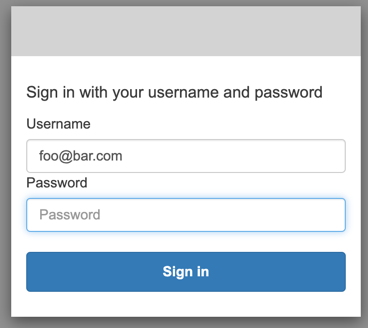

# Feedback Sentiment Analyzer (FSA)

Feedback Sentiment Analyzer (FSA) is an example application that showcases AWS services and SDKs. Built with ❤️ for you to explore, download, and deploy.

## What it does

Specifically, this application solves a fictitious use case of a hotel in New York City, which receives feedback from guests through comment cards in a variety of foreign languages.

These comment cards are uploaded through a web client, transformed using a suite of machine learning services, and rendered through the same web client.

---

## SDK implementations

This application has been implemented with the AWS SDKs below. You can use deploy one of these implementations by following the [Deployment instructions](#deployment-instructions).

- [Ruby](../../ruby/cross-services/feedback-sentiment-analyzer/README.md)

---

## AWS services used

This application uses a suite of [machine learning services on AWS](https://aws.amazon.com/machine-learning/) to:

- extract text using [Amazon Textract](https://aws.amazon.com/textract/).
- detect sentiment using [Amazon Comprehend](https://aws.amazon.com/comprehend/).
- translate to English using [Amazon Translate](https://aws.amazon.com/translate/).
- synthesize to human-like speech using [Amazon Polly](https://aws.amazon.com/polly/).

Additionally, the application showcases:

- [Amazon S3](https://aws.amazon.com/s3/) to store images of comment cards.
- [EventBridge](https://aws.amazon.com/eventbridge/) to relay events from Amazon S3.
- [AWS Lambda](https://aws.amazon.com/lambda/) to execute business logic.
- [Step Functions](https://aws.amazon.com/stepfunctions/) to orchestrate multiple Lambda functions.
- [Amazon DynamoDB](https://aws.amazon.com/dynamodb/) to store details about each comment.
- [API Gateway](https://aws.amazon.com/apigw/) to route requests from frontend to backend.
- [CloudFront](https://aws.amazon.com/cloudfront/) to distribute this application globally.
- [Cognito](https://aws.amazon.com/cognito) to authenticate users.

---

## Deployment instructions

This application is deployed using the [AWS Cloud Development Kit (CDK)](https://aws.amazon.com/cdk/).

1. Get [AWS credentials](https://docs.aws.amazon.com/cli/latest/userguide/cli-configure-files.html).
1. Set the environment variables below:

   - `FSA_NAME` - Any text less than 10 characters.
   - `FSA_EMAIL` - A valid email address you own.
   - `FSA_LANG` - Any of the [implemented languages](#sdk-implementations).

   For example:

   _Bash_

   ```
   export FSA_NAME=foo
   export FSA_EMAIL=foo@bar.com
   export FSA_LANG=ruby
   ```

   _Windows cmd_

   ```
   set FSA_NAME=foo
   set FSA_EMAIL=foo@bar.com
   set FSA_LANG=ruby
   ```

   _Windows Powershell_

   ```
   $Env:FSA_NAME = foo
   $Env:FSA_EMAIL = foo@bar.com
   $Env:FSA_LANG = ruby
   ```

1. Run the commands below:
   ```
   cd cdk
   npm install
   cdk deploy
   ```
   Once deployed, observe the `Output` in your terminal session.
   Copy the CloudFront distribution URL, which will have `websiteurl` in the name.
   
   Paste this URL into a browser to launch the application.

---

## Application instructions

### Log in

1. Choose `Sign in`.
2. Enter the the email from `FSA_EMAIL` into the `Username` field.
3. Enter the temporary password that was sent to you into the `Password` field.
   
4. Reset your password as prompted.

### Upload images

1. Log in directs you to a landing page that says `No data found`.
   
2. Choose `Upload`.
3. Choose `Select a file`.
4. Select a PNG or JPEG image that contains a positive comment about the hotel. Negative comments are saved, but not returned to the frontend.
   
5. Choose `Upload`.

### Play the result

1. Wait. The image upload takes a minute or two to process.
2. Choose the `Refresh` button.
   
3. You should see a card with the original image, translated text, and a play button.
   
4. Choose the play button to listen to the translated audio.
