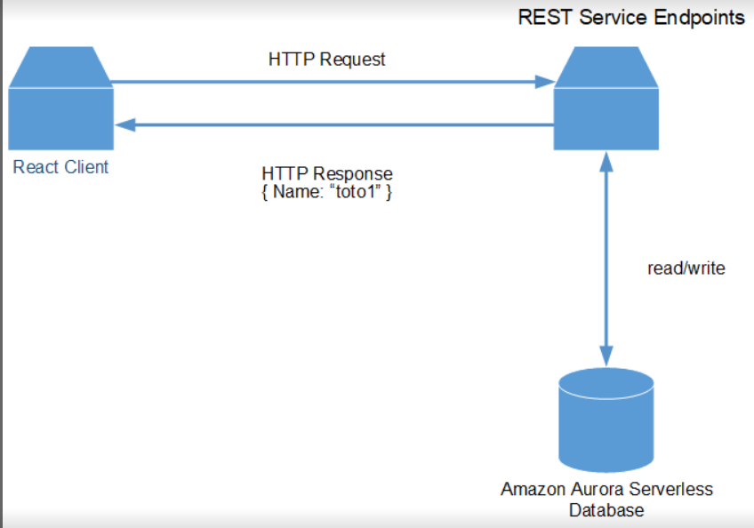
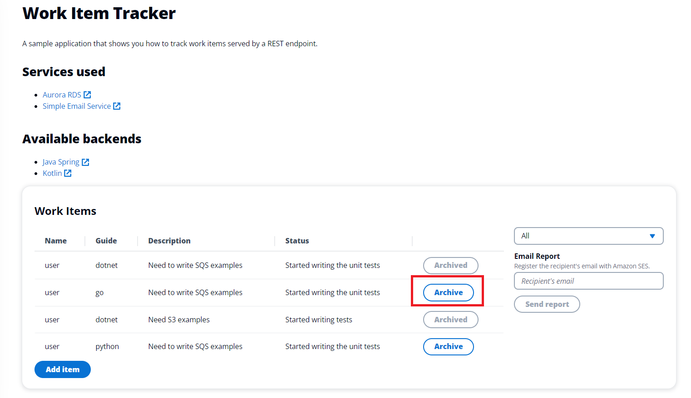
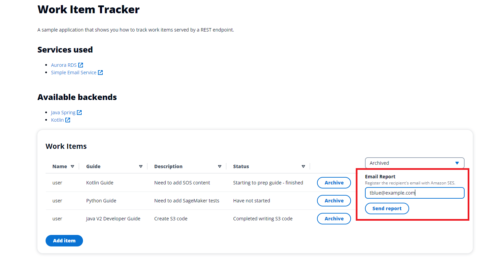
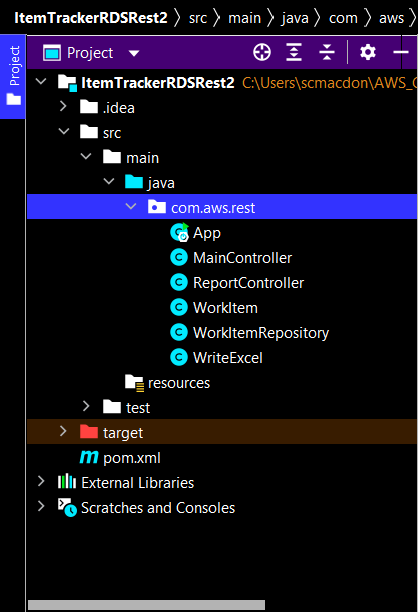

#  Building an Amazon Aurora Serverless Web Application with Spring Boot

## Overview

| Heading      | Description |
| ----------- | ----------- |
| Description | Discusses how to develop a Spring Boot application that queries Amazon Aurora Serverless data. The Spring Boot application uses the AWS SDK for Java (v2) to invoke AWS services and is used by a React application that displays the data. The React application uses Cloudscape. For information, see [Cloudscape](https://cloudscape.design/).    |
| Audience   |  Developer (intermediate)        |
| Required skills   | Java, Maven, JavaScript  |

## Purpose

You can develop a dynamic web application that tracks and reports on work items by using the following AWS services:

+ Amazon Aurora Serverless database (Amazon RDS)
+ Amazon Simple Email Service (Amazon SES). (The SDK for Java (v2) is used to access Amazon SES.)

The application you create is a decoupled React application that uses a Spring REST API to return Amazon Aurora Serverless data. That is, the React application interacts with a Spring API by making RESTful GET and POST requests. The Spring API uses an [RdsDataClient](https://sdk.amazonaws.com/java/api/latest/software/amazon/awssdk/services/rdsdata/RdsDataClient.html) object to perform CRUD operations on the Aurora Serverless database. Then, the Spring REST API returns JSON data in an HTTP response, as shown in the following illustration. 



**Note:** You can only use the **RdsDataClient** object for an Aurora Serverless DB cluster or Aurora PostgreSQL. For more information, see [Using the Data API for Aurora Serverless](https://docs.aws.amazon.com/AmazonRDS/latest/AuroraUserGuide/data-api.html).  

#### Topics

+ Prerequisites
+ Understand the AWS Tracker application
+ Create an IntelliJ project named ItemTrackerRDS
+ Add the Spring POM dependencies to your project
+ Create the Java classes
+ Create the React front end

## Prerequisites

To complete the tutorial, you need the following:

+ An AWS account.
+ A Java IDE to build the Spring REST API. This tutorial uses the IntelliJ IDE.
+ Java JDK 17.
+ Maven 3.6 or later.
+ Set up your development environment. For more information, 
see [Get started with the SDK for Java](https://docs.aws.amazon.com/sdk-for-java/latest/developer-guide/setup.html). 

### Important

+ The AWS services in this document are included in the [AWS Free Tier](https://aws.amazon.com/free/?all-free-tier.sort-by=item.additionalFields.SortRank&all-free-tier.sort-order=asc).
+  This code has not been tested in all AWS Regions. Some AWS services are available only in specific Regions. For more information, see [AWS Regional Services](https://aws.amazon.com/about-aws/global-infrastructure/regional-product-services). 
+ Running this code might result in charges to your AWS account. 
+ Be sure to delete all of the resources that you create during this tutorial so that you won't be charged.

### Creating the resources

You can use one of the following ways to create the required AWS resources:

- Using the AWS Management console
- Using the AWS Cloud Development Kit

#### Using the AWS Management console

Create an Aurora Serverless database named **jobs**. Next, create a table named **Work** that contains the following fields:

+ **idwork** - A VARCHAR(45) value that represents the PK.
+ **date** - A date value that specifies the date the item was created.
+ **description** - A VARCHAR(400) value that describes the item.
+ **guide** - A VARCHAR(45) value that represents the deliverable being worked on.
+ **status** - A VARCHAR(400) value that describes the status.
+ **username** - A VARCHAR(45) value that represents the user who entered the item.
+ **archive** - A TINYINT(4) value that represents whether this is an active or archive item.

The following figure shows the **Work** table in the Amazon RDS console.


For more information, see [Creating an Aurora Serverless v1 DB cluster](https://docs.aws.amazon.com/AmazonRDS/latest/AuroraUserGuide/aurora-serverless.create.html).

To successfully connect to the database using the **RdsDataClient** object, set up an AWS Secrets Manager secret to use for authentication. For more information, see [Rotate Amazon RDS database credentials automatically with AWS Secrets Manager](https://aws.amazon.com/blogs/security/rotate-amazon-rds-database-credentials-automatically-with-aws-secrets-manager/). 

To use the **RdsDataClient** object, you must have the following two Amazon Resource Name (ARN) values: 

+ The ARN of an Aurora Serverless database.
+ The ARN of a Secrets Manager secret to use for database access.

**Note:** You must set up inbound rules for the security group to connect to the database. You can set up an inbound rule for your development environment. Setting up an inbound rule essentially means enabling an IP address to use the database. After you set up the inbound rules, you can connect to the database from the REST endpoint. For information about setting up security group inbound rules, see [Controlling Access with Security Groups](https://docs.aws.amazon.com/AmazonRDS/latest/UserGuide/Overview.RDSSecurityGroups.html).  

#### Using the AWS Cloud Development Kit

Using the AWS AWS Cloud Development Kit (AWS CDK), you can set up the resources required for this tutorial. For more information, see [CDK instructions](https://github.com/awsdocs/aws-doc-sdk-examples/tree/main/resources/cdk/aurora_serverless_app/README.md).

## Understand the AWS Tracker React application 

A user can perform the following tasks using the React application:

+ View all active items.
+ View archived items that are complete.
+ Add a new item. 
+ Convert an active item into an archived item.
+ Send a report to an email recipient.

The React application displays *active* and *archive* items. For example, the following illustration shows the React application displaying active data.


Likewise, the following illustration shows the React application displaying archived data.


**Note**: Notice that the **Archived** button is disabled. 

The React application lets a user convert an active item to an archived item by clicking the **Archive** button. 



The React application also lets a user enter a new item. 


The user can enter an email recipient into the **Email Report** text field and choose **Send report**.



Active items are queried from the database and used to dynamically create an Excel document. Then, the application uses Amazon SES to email the document to the selected email recipient. The following image shows an example of a report.


## Create an IntelliJ project named ItemTrackerRDSRest

1. In the IntelliJ IDE, choose **File**, **New**, **Project**. 
2. In the **Project SDK**, choose **17**. 
3. In the **New Project** dialog box, choose **Maven**, and then choose **Next**.
4. For **GroupId**, enter **aws-spring**.
5. For **ArtifactId**, enter **ItemTrackerRDSRest**.
6. Choose **Next**.
7. Choose **Finish**.

## Add the POM dependencies to your project

Make sure that your project's pom.xml file looks like the POM file in this Github repository.

## Create the Java classes

Create a Java package in the **main/java** folder named **com.aws.rest**. 



The following Java files go into this package:

+ **App** - The entry point into the Spring boot application.  
+ **MainController** - Represents the Spring Controller that handles HTTP requests to handle data operations.
+ **ReportController** - Represents a second Spring Controller that handles HTTP requests that generates a report.
+ **WorkItemRepository** - A Spring class that extends **CrudRepository** and uses the AWS SDK for Java (v2) that performs database operations. 
+ **WorkItem** - Represents the application's data model.
+ **WriteExcel** - Uses the Java Excel API to dynamically create a report. (This does not use AWS SDK for Java API operations).

### App class 

The following Java code represents the **App** class. This is the entry point into a Spring boot application. 

```java
package com.aws.rest;

import org.springframework.boot.SpringApplication;
import org.springframework.boot.autoconfigure.SpringBootApplication;
import software.amazon.awssdk.regions.Region;

@SpringBootApplication
public class App {
    public static final Region region = Region.US_EAST_1;

    public static void main(String[] args) {
        SpringApplication.run(App.class, args);
    }
}
```    

### MainController class

The following Java code represents the **MainController** class, which handles HTTP requests for the application. Notice the use of the **CrossOrigin** annotation. This annotation lets the controller accept requests from different domains. 

```java
package com.aws.rest;

import org.springframework.beans.factory.annotation.Autowired;
import org.springframework.context.annotation.ComponentScan;
import org.springframework.web.bind.annotation.CrossOrigin;
import org.springframework.web.bind.annotation.GetMapping;
import org.springframework.web.bind.annotation.PathVariable;
import org.springframework.web.bind.annotation.PostMapping;
import org.springframework.web.bind.annotation.PutMapping;
import org.springframework.web.bind.annotation.RequestBody;
import org.springframework.web.bind.annotation.RequestMapping;
import org.springframework.web.bind.annotation.RequestParam;
import org.springframework.web.bind.annotation.RestController;
import java.time.LocalDateTime;
import java.util.List;
import java.util.Map;
import java.util.UUID;
import java.util.stream.Collectors;
import java.util.stream.StreamSupport;

@ComponentScan(basePackages = {"com.aws.services"})
@CrossOrigin(origins = "*")
@RestController
@RequestMapping("api/items")
public class MainController {
    private final WorkItemRepository repository;

    @Autowired
    MainController(
        WorkItemRepository repository
    ) {
        this.repository = repository;
    }

    @GetMapping("" )
    public List<WorkItem> getItems(@RequestParam(required=false) String archived) {
        Iterable<WorkItem> result;
        if (archived != null)
            result = repository.findAllWithStatus(archived);
        else
            result = repository.findAllWithStatus("");

        return StreamSupport.stream(result.spliterator(), false)
            .collect(Collectors.toUnmodifiableList());
    }

    // Notice the : character which is used for custom methods. More information can be found here:
    // https://cloud.google.com/apis/design/custom_methods
    @PutMapping("{id}:archive")
    public List<WorkItem> modUser(@PathVariable String id) {
        repository.flipItemArchive(id);
        Iterable<WorkItem> result = repository.findAllWithStatus("false");
        return StreamSupport.stream(result.spliterator(), false)
            .collect(Collectors.toUnmodifiableList());
    }

    @PostMapping("")
    public List<WorkItem> addItem(@RequestBody Map<String, String> payload) {
        String name = payload.get("name");
        String guide = payload.get("guide");
        String description = payload.get("description");
        String status = payload.get("description");

        WorkItem item = new WorkItem();
        String workId = UUID.randomUUID().toString();
        String date = LocalDateTime.now().toString();
        item.setId(workId);
        item.setGuide(guide);
        item.setDescription(description);
        item.setName(name);
        item.setDate(date);
        item.setStatus(status);
        repository.save(item);

        // Return active records.
        Iterable<WorkItem> result = repository.findAllWithStatus("false");
        return StreamSupport.stream(result.spliterator(), false)
            .collect(Collectors.toUnmodifiableList());
    }
}
```

### ReportController class

The following Java code represents the **ReportController** class. 

```java
package com.aws.rest;

import jxl.write.WriteException;
import org.springframework.beans.factory.annotation.Autowired;
import org.springframework.web.bind.annotation.CrossOrigin;
import org.springframework.web.bind.annotation.PutMapping;
import org.springframework.web.bind.annotation.RequestBody;
import org.springframework.web.bind.annotation.RequestMapping;
import org.springframework.web.bind.annotation.RestController;
import java.io.IOException;
import java.io.InputStream;
import java.util.Map;


@CrossOrigin(origins = "*")
@RestController
@RequestMapping("api/items:report")
public class ReportController {

    private final WorkItemRepository repository;

    private final WriteExcel writeExcel;

    private final WriteExcel.SendMessages sm;
    @Autowired()
    ReportController(
        WorkItemRepository repository,
        WriteExcel writeExcel,
        WriteExcel.SendMessages sm
    ) {
        this.repository = repository;
        this.writeExcel = writeExcel;
        this.sm = sm;
    }

    @PutMapping("")
    public String sendReport(@RequestBody Map<String, String> body) {
        var list = repository.findAllWithStatus(WorkItemRepository.active);
        try {
            InputStream is = writeExcel.write(list);
            sm.sendReport(is, body.get("email"));
            return "Report generated & sent";
        } catch (IOException | WriteException e) {
            e.printStackTrace();
        }
        return "Failed to generate report";
    }
}
```

### WorkItemRepository class

The following Java code represents the **WorkItemRepository** class that implements [Interface CrudRepository](https://docs.spring.io/spring-data/commons/docs/current/api/org/springframework/data/repository/CrudRepository.html). Notice that you are required to specify ARN values for Secrets Manager and the Amazon Aurora Serverless database (as discussed in the Creating the resources section). Without both of these values, your code won't work. To use the **RDSDataClient**, you must create an **ExecuteStatementRequest** object and specify both ARN values, the database name, and the SQL statement. 

In addition, notice the use of [Class SqlParameter](https://sdk.amazonaws.com/java/api/latest/software/amazon/awssdk/services/rdsdata/model/SqlParameter.html) when using SQL statements. For example, in the **save** method, you build a list of **SqlParameter** objects used to add a new record to the database.

```java
package com.aws.rest;

import org.springframework.data.repository.CrudRepository;
import org.springframework.stereotype.Component;
import software.amazon.awssdk.services.rdsdata.RdsDataClient;
import software.amazon.awssdk.services.rdsdata.model.ExecuteStatementRequest;
import software.amazon.awssdk.services.rdsdata.model.ExecuteStatementResponse;
import software.amazon.awssdk.services.rdsdata.model.Field;
import software.amazon.awssdk.services.rdsdata.model.RdsDataException;
import software.amazon.awssdk.services.rdsdata.model.SqlParameter;
import java.text.ParseException;
import java.text.SimpleDateFormat;
import java.time.LocalDateTime;
import java.time.format.DateTimeFormatter;
import java.util.Date;
import java.util.List;
import java.util.Optional;
import java.util.UUID;
import java.util.stream.Collectors;
import java.util.stream.StreamSupport;

@Component()
public class WorkItemRepository implements CrudRepository<WorkItem, String> {
    static final String active = "0";
    static final String archived = "1";
    static final String database = "jobs";
    static final String secretArn = "<ENTER VALUE>";
    static final String resourceArn = "<ENTER VALUE>";

    static RdsDataClient getClient() {
        return RdsDataClient.builder().region(App.region).build();
    }

    static ExecuteStatementResponse execute(String sqlStatement, List<SqlParameter> parameters) {
        var sqlRequest = ExecuteStatementRequest.builder()
            .resourceArn(resourceArn)
            .secretArn(secretArn)
            .database(database)
            .sql(sqlStatement)
            .parameters(parameters)
            .build();
        return getClient().executeStatement(sqlRequest);
    }

    static SqlParameter param(String name, String value) {
        return SqlParameter.builder().name(name).value(Field.builder().stringValue(value).build()).build();
    }

    @Override
    public <S extends WorkItem> S save(S item) {
        String name = item.getName();
        String guide = item.getGuide();
        String description = item.getDescription();
        String status = item.getStatus();
        String archived = "0";

        UUID uuid = UUID.randomUUID();
        String workId = uuid.toString();

        DateTimeFormatter dtf = DateTimeFormatter.ofPattern("yyyy/MM/dd HH:mm:ss");
        LocalDateTime now = LocalDateTime.now();
        String sDate1 = dtf.format(now);
        Date date1 = null;
        try {
            date1 = new SimpleDateFormat("yyyy/MM/dd").parse(sDate1);
        } catch (ParseException e) {
            e.printStackTrace();
        }
        assert date1 != null;
        java.sql.Date sqlDate = new java.sql.Date(date1.getTime());

        String sql = "INSERT INTO work (idwork, username, date, description, guide, status, archive) VALUES" +
            "(:idwork, :username, :date, :description, :guide, :status, :archive);";
        List<SqlParameter> paremeters = List.of(
            param("idwork", workId),
            param("username", name),
            param("date", sqlDate.toString()),
            param("description", description),
            param("guide", guide),
            param("status", status),
            param("archive", archived)
        );

        ExecuteStatementResponse result = execute(sql, paremeters);
        System.out.println(result.toString());
        return (S) findById(workId).get();
    }

    @Override
    public <S extends WorkItem> Iterable<S> saveAll(Iterable<S> entities) {
        return StreamSupport.stream(entities.spliterator(), true).map(this::save)::iterator;
    }

    @Override
    public Optional<WorkItem> findById(String s) {
        String sqlStatement = "SELECT idwork, date, description, guide, status, username, archive FROM work WHERE idwork = :id;";
        List<SqlParameter> parameters = List.of(param("id", s));
        var result = execute(sqlStatement, parameters)
            .records()
            .stream()
            .map(WorkItem::from)
            .collect(Collectors.toUnmodifiableList());
        if (result.isEmpty()) {
            return Optional.empty();
        } else {
            return Optional.of(result.get(0));
        }
    }

    @Override
    public boolean existsById(String s) {
        return findById(s).isPresent();
    }

    @Override
    public Iterable<WorkItem> findAll() {
        return findAllWithStatus(active);
    }

    public void flipItemArchive(String id) {
        try {
            String sqlStatement = "UPDATE work SET archive = (:arch) WHERE idwork = (:id);";
            List<SqlParameter> parameters = List.of(
                param("id", id),
                param("arch", archived)
            );
            execute(sqlStatement, parameters);
        } catch (RdsDataException e) {
            e.printStackTrace();
        }
    }


    public Iterable<WorkItem> findAllWithStatus(String status) {
        String sqlStatement;
        String isArc;

        if (status.compareTo("true") == 0) {
            sqlStatement = "SELECT idwork, date, description, guide, status, username, archive " +
                "FROM work WHERE archive = :arch ;";
            isArc = "1";
            List<SqlParameter> parameters = List.of(
                param("arch", isArc)
            );
            return execute(sqlStatement, parameters)
                .records()
                .stream()
                .map(WorkItem::from)
                .collect(Collectors.toUnmodifiableList());

        } else if (status.compareTo("false") == 0) {
            sqlStatement = "SELECT idwork, date, description, guide, status, username, archive " +
                "FROM work WHERE archive = :arch ;";
            isArc = "0";
            List<SqlParameter> parameters = List.of(
                param("arch", isArc)
            );
            return execute(sqlStatement, parameters)
                .records()
                .stream()
                .map(WorkItem::from)
                .collect(Collectors.toUnmodifiableList());

        } else {
            sqlStatement = "SELECT idwork, date, description, guide, status, username, archive FROM work ;";
            List<SqlParameter> parameters = List.of(

            );
            return execute(sqlStatement, parameters)
                .records()
                .stream()
                .map(WorkItem::from)
                .collect(Collectors.toUnmodifiableList());
        }
    }

    @Override
    public Iterable<WorkItem> findAllById(Iterable<String> strings) {
        var item = findById(strings.iterator().next());
        if (item.isPresent()) {
            return List.of(item.get());
        }
        return List.of();
    }

    @Override
    public long count() {
        String sqlStatement = "SELECT COUNT(idwork) AS count FROM work;";
        List<SqlParameter> parameters = List.of();
        return execute(sqlStatement, parameters)
            .records()
            .stream()
            .map(fields -> fields.get(0).longValue()).iterator().next();
    }

    @Override
    public void deleteById(String s) {
        String sqlStatement = "DELETE FROM work WHERE idwork = :id;";
        List<SqlParameter> parameters = List.of(param("id", s));
        execute(sqlStatement, parameters);
    }

    @Override
    public void delete(WorkItem entity) {
        deleteById(entity.getId());
    }

    @Override
    public void deleteAllById(Iterable<? extends String> strings) {
        strings.forEach(this::deleteById);
    }

    @Override
    public void deleteAll(Iterable<? extends WorkItem> entities) {
        deleteAllById(StreamSupport.stream(entities.spliterator(), false).map(WorkItem::getId)::iterator);
    }

    @Override
    public void deleteAll() {
        String sqlStatement = "DELETE FROM work;";
        List<SqlParameter> parameters = List.of();
        execute(sqlStatement, parameters);
    }
}

```


### WorkItem class

The following Java code represents the **WorkItem** class.   

```java
package com.aws.rest;

import software.amazon.awssdk.services.rdsdata.model.Field;

import java.util.List;

public class WorkItem {
    private String id;
    private String name;
    private String guide;
    private String date;
    private String description;
    private String status;
    private boolean archived;

    public static WorkItem from(List<Field> fields) {
        var item = new WorkItem();
        boolean arcVal = false;
        for (int i = 0; i <= 6; i++) {
            String value = fields.get(i).stringValue();
            if (i == 6)
                arcVal = fields.get(i).booleanValue();

            switch (i) {
                case 0:
                    item.setId(value);
                    break;
                case 1:
                    item.setDate(value);
                    break;
                case 2:
                    item.setDescription(value);
                    break;
                case 3:
                    item.setGuide(value);
                    break;
                case 4:
                    item.setStatus(value);
                    break;
                case 5:
                    item.setName(value);
                    break;

                case 6:
                    item.setArchived(arcVal);
                    break;
            }
        }
        return item;
    }

    public void setArchived(boolean archived) {
        this.archived =archived;
    }

    public boolean getArchived() {
        return this.archived;
    }

    public void setId(String id) {
        this.id = id;
    }

    public String getId() {
        return this.id;
    }

    public void setStatus(String status) {
        this.status = status;
    }

    public String getStatus() {
        return this.status;
    }

    public void setDescription(String description) {
        this.description = description;
    }

    public String getDescription() {
        return this.description;
    }


    public void setDate(String date) {
        this.date = date;
    }

    public String getDate() {
        return this.date;
    }

    public void setName(String name) {
        this.name = name;
    }

    public String getName() {
        return this.name;
    }

    public void setGuide(String guide) {
        this.guide = guide;
    }

    public String getGuide() {
        return this.guide;
    }
}
```
### WriteExcel class

The **WriteExcel** class dynamically creates an Excel report with the data marked as active. In addition, notice the use of the **SendMessage** class that uses the Amazon SES Java API to send email messages. The following code represents this class.

```java
  package com.aws.rest;

import jxl.CellView;
import jxl.Workbook;
import jxl.WorkbookSettings;
import jxl.format.UnderlineStyle;
import jxl.write.Label;
import jxl.write.WritableCellFormat;
import jxl.write.WritableFont;
import jxl.write.WritableSheet;
import jxl.write.WritableWorkbook;
import jxl.write.WriteException;
import org.apache.commons.io.IOUtils;
import org.springframework.stereotype.Component;
import software.amazon.awssdk.core.SdkBytes;
import software.amazon.awssdk.services.ses.SesClient;
import software.amazon.awssdk.services.ses.model.RawMessage;
import software.amazon.awssdk.services.ses.model.SendRawEmailRequest;
import software.amazon.awssdk.services.ses.model.SesException;
import javax.activation.DataHandler;
import javax.activation.DataSource;
import javax.mail.Message;
import javax.mail.MessagingException;
import javax.mail.Session;
import javax.mail.internet.InternetAddress;
import javax.mail.internet.MimeBodyPart;
import javax.mail.internet.MimeMessage;
import javax.mail.internet.MimeMultipart;
import javax.mail.util.ByteArrayDataSource;
import java.io.ByteArrayInputStream;
import java.io.ByteArrayOutputStream;
import java.io.IOException;
import java.io.InputStream;
import java.nio.ByteBuffer;
import java.util.Locale;
import java.util.Properties;

@Component
public class WriteExcel {
    static WritableCellFormat times ;
    static WritableCellFormat timesBoldUnderline;

    static {
        try {
            WritableFont times10pt = new WritableFont(WritableFont.TIMES, 10);
            times = new WritableCellFormat(times10pt);
            times.setWrap(true);

            WritableFont times10ptBoldUnderline = new WritableFont(WritableFont.TIMES, 10, WritableFont.BOLD, false, UnderlineStyle.SINGLE);
            timesBoldUnderline = new WritableCellFormat(times10ptBoldUnderline);
            timesBoldUnderline.setWrap(true);
        } catch (WriteException e) {
            e.printStackTrace();
        }
    }

    public InputStream write(Iterable<WorkItem> items) throws IOException, WriteException {
        ByteArrayOutputStream os = new ByteArrayOutputStream();
        WorkbookSettings wbSettings = new WorkbookSettings();
        wbSettings.setLocale(new Locale("en", "US"));

        WritableWorkbook workbook = Workbook.createWorkbook(os, wbSettings);
        workbook.createSheet("Work Item Report", 0);
        WritableSheet excelSheet = workbook.getSheet(0);

        addLabels(excelSheet);
        fillContent(excelSheet, items);

        workbook.write();
        workbook.close();

        return new ByteArrayInputStream(os.toByteArray());
    }

    private void addLabels(WritableSheet sheet) throws WriteException {
        CellView cv = new CellView();
        cv.setFormat(timesBoldUnderline);
        cv.setAutosize(true);

        addCaption(sheet, 0, 0, "Writer");
        addCaption(sheet, 1, 0, "Date");
        addCaption(sheet, 2, 0, "Guide");
        addCaption(sheet, 3, 0, "Description");
        addCaption(sheet, 4, 0, "Status");
    }

    private void addCaption(WritableSheet sheet, int column, int row, String s) throws WriteException {
        Label label = new Label(column, row, s, timesBoldUnderline);
        int cc = s.length();
        sheet.setColumnView(column, cc);
        sheet.addCell(label);
    }

    private void addField(WritableSheet sheet, int column, int row, String s) throws WriteException {
        Label label = new Label(column, row, s, timesBoldUnderline);
        int cc = s.length();
        cc = cc > 200 ? 150 : cc + 6;
        sheet.setColumnView(column, cc);
        sheet.addCell(label);
    }

    private void fillContent(WritableSheet sheet, Iterable<WorkItem> items) throws WriteException {
        int row = 2;
        for (WorkItem item : items) {
            addField(sheet, 0, row, item.getName());
            addField(sheet, 1, row, item.getDate());
            addField(sheet, 2, row, item.getGuide());
            addField(sheet, 3, row, item.getDescription());
            addField(sheet, 4, row, item.getStatus());
            row += 1;
        }
    }

    @Component
    public static class SendMessages {
        private static String sender = "<ENTER VALUE>"; // CHANGE THIS VALUE.
        private static String subject = "Weekly AWS Status Report";
        private static String bodyText = "Hello,\r\n\r\nPlease see the attached file for a weekly update.";
        private static String bodyHTML = "<!DOCTYPE html><html lang=\"en-US\"><body><h1>Hello!</h1><p>Please see the attached file for a weekly update.</p></body></html>";
        private static String attachmentName = "WorkReport.xls";

        public void sendReport(InputStream is, String emailAddress) throws IOException {
            byte[] fileContent = IOUtils.toByteArray(is);

            try {
                send(makeEmail(fileContent, emailAddress));
            } catch (MessagingException e) {
                e.printStackTrace();
            }
        }

        public void send(MimeMessage message) throws MessagingException, IOException {
            ByteArrayOutputStream outputStream = new ByteArrayOutputStream();
            message.writeTo(outputStream);
            ByteBuffer buf = ByteBuffer.wrap(outputStream.toByteArray());
            byte[] arr = new byte[buf.remaining()];
            buf.get(arr);
            SdkBytes data = SdkBytes.fromByteArray(arr);
            RawMessage rawMessage = RawMessage.builder().data(data).build();
            SendRawEmailRequest rawEmailRequest = SendRawEmailRequest.builder().rawMessage(rawMessage).build();

            try {
                System.out.println("Attempting to send an email through Amazon SES...");
                SesClient client = SesClient.builder().region(App.region).build();
                client.sendRawEmail(rawEmailRequest);
            } catch (SesException e) {
                e.printStackTrace();
            }
        }

        private MimeMessage makeEmail(byte[] attachment, String emailAddress) throws MessagingException {
            Session session = Session.getDefaultInstance(new Properties());
            MimeMessage message = new MimeMessage(session);

            message.setSubject(subject, "UTF-8");
            message.setFrom(new InternetAddress(sender));
            message.setRecipients(Message.RecipientType.TO, InternetAddress.parse(emailAddress));

            MimeBodyPart textPart = new MimeBodyPart();
            textPart.setContent(bodyText, "text/plain; charset=UTF-8");

            MimeBodyPart htmlPart = new MimeBodyPart();
            htmlPart.setContent(bodyHTML, "text/html; charset=UTF-8");

            MimeMultipart msgBody = new MimeMultipart("alternative");
            msgBody.addBodyPart(textPart);
            msgBody.addBodyPart(htmlPart);

            MimeBodyPart wrap = new MimeBodyPart();
            wrap.setContent(msgBody);

            MimeMultipart msg = new MimeMultipart("mixed");
            msg.addBodyPart(wrap);

            MimeBodyPart att = new MimeBodyPart();
            DataSource fds = new ByteArrayDataSource(attachment, "application/vnc.openxmlformats-officedocument.spreadsheetml.sheet");
            att.setDataHandler(new DataHandler(fds));
            att.setFileName(attachmentName);

            msg.addBodyPart(att);

            message.setContent(msg);

            return message;
        }
    }
}
```
**Note:** Notice that the **SendMessages** is part of this Java file. You must update the email **sender** address with a verified email address. Otherwise, the email is not sent. For more information, see [Verifying email addresses in Amazon SES](https://docs.aws.amazon.com/ses/latest/DeveloperGuide/verify-email-addresses.html).       

## Run the application 

Using the IntelliJ IDE, you can run your Spring REST API. The first time you run it, choose the run icon in the main class. The Spring API supports the following URLs. 

- /api/items - A GET request that returns all data items from the **Work** table. 
- /api/items?archived=true - A GET request that returns either active or archive data items from the **Work** table. 
- /api/items/{id}:archive - A PUT request that converts the specified data item to an archived item. 
- /api/items - A POST request that adds a new item to the database. 
- api/items:report - A POST request that creates a report of active items and emails the report. 

**Note**: The React application created in the next section consumes all of these URLs. 

Confirm that the Spring REST API works by viewing the Active items. Enter the following URL into a browser. 

http://localhost:8080/api/items

The following illustration shows the JSON data returned from the Spring REST API. 


## Create the React front end

You can create the React application that consumes the JSON data returned from the Spring REST API. To create the React application, you can download files from the following GitHub repository. Included in this repository are instructions on how to set up the project. Click the following link to access the GitHub location [Work item tracker web client](https://github.com/awsdocs/aws-doc-sdk-examples/tree/main/resources/clients/react/elwing).  

### Update BASE_URL

You must ensure that the **BASE_URL** is correct. In the **config.json** file, ensure this value references your Spring application.

```javascript
{
  "BASE_URL": "http://localhost:8080/api"
}
```
  
### Next steps
Congratulations, you have created a decoupled React application that consumes data from a Spring REST API. The Spring REST API uses the AWS SDK for Java (v2) to invoke AWS services. As stated at the beginning of this tutorial, be sure to delete all of the resources that you create during this tutorial so that you won't continue to be charged.

For more AWS multiservice examples, see
[usecases](https://github.com/awsdocs/aws-doc-sdk-examples/tree/master/javav2/usecases).
