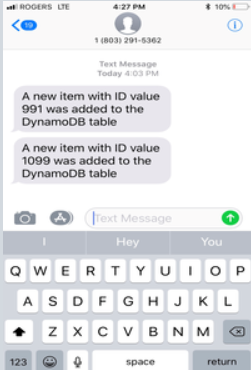
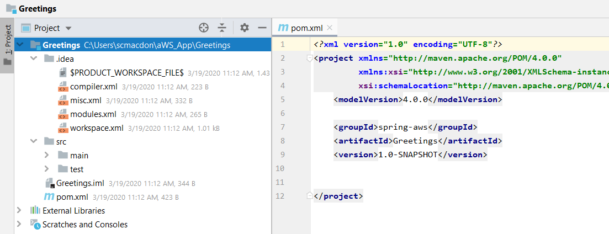
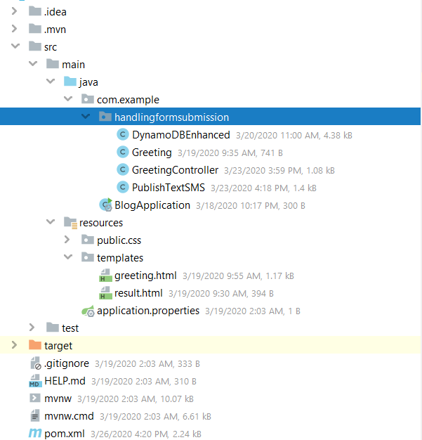
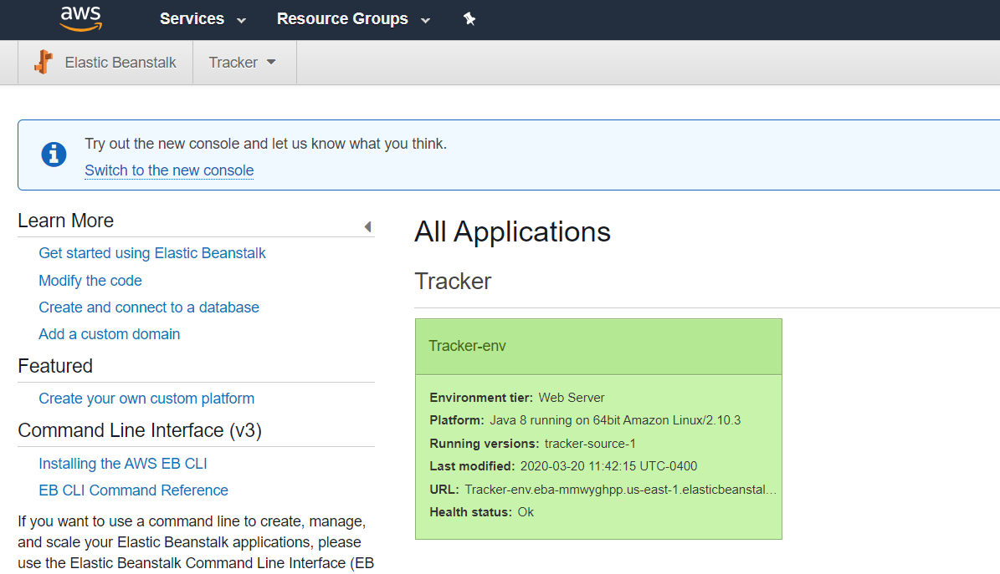
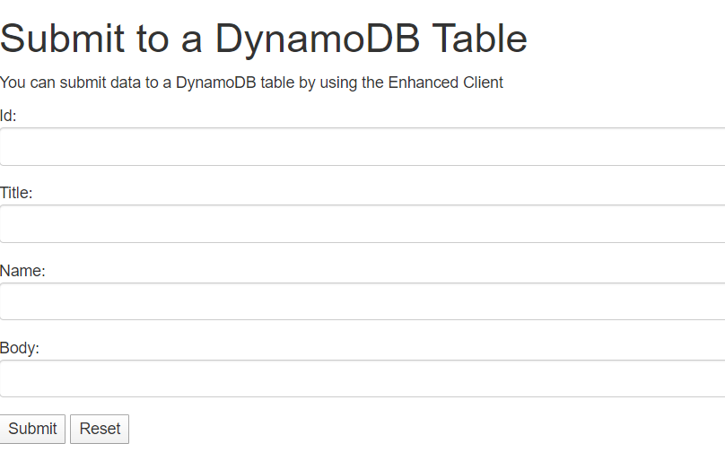

# Creating your first AWS Java web application

## Purpose
You can develop a dynamic web application that users can use to submit data to an Amazon DynamoDB table. In addition to using Amazon DynamoDB, this web application also uses the Amazon Simple Notification Service (Amazon SNS) and AWS Elastic Beanstalk. This application uses the **software.amazon.awssdk.enhanced.dynamodb.DynamoDbEnhancedClient** to store data within a DynamoDB table. After the DynamoDB table is updated, the application uses Amazon SNS to send a text message to notify a user. This application also uses Spring Boot APIs to build a model, views, and a controller.

The DynamoDB enhanced client lets you map your client-side classes to Amazon DynamoDB tables. To use the DynamoDB enhanced client, you define the relationship between items in a DynamoDB table and their corresponding object instances in your code. The DynamoDB enhanced client enables you to do the following:

* Access your tables
* Perform various create, read, update, and delete (CRUD) operations
* Execute queries

**Note:** For more information about the DynamoDB enhanced client, see [Map items in DynamoDB tables](https://docs.aws.amazon.com/sdk-for-java/v2/developer-guide/examples-dynamodb-enhanced.html).

The following shows the application you'll create.

When you choose **Submit**, the data is submitted to a Spring Controller and persisted into a DynamoDB table named **Greeting**. Then a text message is sent to a user. The following is the **Greeting** table.

After the table is updated with a new item, a text message is sent to notify a mobile user.

This tutorial guides you through creating an AWS application that uses Spring Boot. After you develop the application, you'll learn how to deploy it to Elastic Beanstalk.

## Prerequisites

To complete the tutorial, you need the following:

+ An AWS account
+ A Java IDE (this example uses IntelliJ)
+ Java 1.8 SDK and Maven

### Important

+ The AWS services included in this document are included in the [AWS Free Tier](https://aws.amazon.com/free/?all-free-tier.sort-by=item.additionalFields.SortRank&all-free-tier.sort-order=asc).
+  This code has not been tested in all AWS Regions. Some AWS services are available only in specific regions. For more information, see [AWS Regional Services](https://aws.amazon.com/about-aws/global-infrastructure/regional-product-services). 
+ Running this code might result in charges to your AWS account. 
+ Be sure to terminate all of the resources you create while going through this tutorial to ensure that you’re not charged.

### Creating the resources

The AWS Services used in this AWS tutorial are:

 - Amazon S3 Service
 - Amazon DynamoDB
 - AWS Step Functions
 
You need to create this resources prior to starting this tutorial:

+ An Amazon DynamoDB table named **Greeting** that contains a partition key named **idblog**. For information about creating an Amazon DynamoDB table, see [Create a Table](https://docs.aws.amazon.com/amazondynamodb/latest/developerguide/getting-started-step-1.html). 

The following figure shows the project that's created.

**Cost to complete:** The AWS services you'll use in this example are part of the [AWS Free Tier](https://aws.amazon.com/free/?all-free-tier.sort-by=item.additionalFields.SortRank&all-free-tier.sort-order=asc).

**Note:** When you're done developing the application, be sure to terminate all of the resources you created to ensure that you're no longer charged.

**Topics**

+ Create an IntelliJ project named **Greetings**
+ Add the Spring POM dependencies to your project
+ Set up the Java packages in your project
+ Create the Java logic for the main Boot class
+ Create the HTML files
+ Package the **Greetings** application into a JAR file
+ Set up the DynamoDB table
+ Deploy the  **Greetings** application to Elastic Beanstalk

## Create an IntelliJ project named Greetings
The first step is to create an IntelliJ project.

1. In the IntelliJ IDE, choose **File**, **New**, **Project**.
2. In the **New Project** dialog box, choose **Maven**.
3. Choose **Next**.
4. In **GroupId**, enter **spring-aws**.
5. In **ArtifactId**, enter **greetings**.
6. Choose **Next**.
7. Choose **Finish**.

## Add the Spring POM dependencies to your project

At this point, you have a new project named **Greetings**.

Inside the **project** element in the **pom.xml** file, add the **spring-boot-starter-parent** dependency.

	<parent>
	    <groupId>org.springframework.boot</groupId>
	    <artifactId>spring-boot-starter-parent</artifactId>
	    <version>2.2.5.RELEASE</version>
	    <relativePath/> <!-- lookup parent from repository -->
	</parent>

Also, add the following Spring Boot **dependency** elements inside the **dependencies** element.

	<dependency>
	    <groupId>org.springframework.boot</groupId>
	    <artifactId>spring-boot-starter-thymeleaf</artifactId>
	</dependency>
	<dependency>
	    <groupId>org.springframework.boot</groupId>
	    <artifactId>spring-boot-starter-web</artifactId>
	</dependency>
	<dependency>
	    <groupId>org.springframework.boot</groupId>
	    <artifactId>spring-boot-starter-test</artifactId>
	    <scope>test</scope>
	    <exclusions>
	        <exclusion>
	            <groupId>org.junit.vintage</groupId>
	            <artifactId>junit-vintage-engine</artifactId>
	        </exclusion>
	    </exclusions>
	</dependency>

Also add these AWS API dependencies.

    <dependencyManagement>
        <dependencies>
            <dependency>
                <groupId>software.amazon.awssdk</groupId>
                <artifactId>bom</artifactId>
                <version>2.16.0</version>
                <type>pom</type>
                <scope>import</scope>
            </dependency>
        </dependencies>
    </dependencyManagement>
    <dependency>
        <groupId>software.amazon.awssdk</groupId>
        <artifactId>dynamodb-enhanced</artifactId>
    </dependency>
    <dependency>
        <groupId>software.amazon.awssdk</groupId>
        <artifactId>dynamodb</artifactId>
    </dependency>
    <dependency>
        <groupId>software.amazon.awssdk</groupId>
        <artifactId>sns</artifactId>
    </dependency>

**Note:** Ensure that you're using Java 1.8 (shown below).

At this point, ensure that the **pom.xml** file resembles the following file.

	<?xml version="1.0" encoding="UTF-8"?>
	<project xmlns="http://maven.apache.org/POM/4.0.0" xmlns:xsi="http://www.w3.org/2001/XMLSchema-instance"
	xsi:schemaLocation="http://maven.apache.org/POM/4.0.0 https://maven.apache.org/xsd/maven-4.0.0.xsd">
	<modelVersion>4.0.0</modelVersion>
	<groupId>spring-aws</groupId>
		<artifactId>greetings</artifactId>
	<version>1.0-SNAPSHOT</version>
	<packaging>jar</packaging>
	<description>Demo project for Spring Boot</description>
	<parent>
	    <groupId>org.springframework.boot</groupId>
	    <artifactId>spring-boot-starter-parent</artifactId>
	    <version>2.2.5.RELEASE</version>
	    <relativePath/> <!-- lookup parent from repository -->
	</parent>
	<properties>
	    <java.version>1.8</java.version>
	</properties>
	<dependencyManagement>
	    <dependencies>
	        <dependency>
	            <groupId>software.amazon.awssdk</groupId>
	            <artifactId>bom</artifactId>
	            <version>2.16.0</version>
	            <type>pom</type>
	            <scope>import</scope>
	        </dependency>
	    </dependencies>
	</dependencyManagement>
	<dependencies>
	    <dependency>
	        <groupId>org.springframework.boot</groupId>
	        <artifactId>spring-boot-starter-thymeleaf</artifactId>
	    </dependency>
	    <dependency>
	        <groupId>org.springframework.boot</groupId>
	        <artifactId>spring-boot-starter-web</artifactId>
	    </dependency>
	    <dependency>
	        <groupId>org.springframework.boot</groupId>
	        <artifactId>spring-boot-starter-test</artifactId>
	        <scope>test</scope>
	        <exclusions>
	            <exclusion>
	                <groupId>org.junit.vintage</groupId>
	                <artifactId>junit-vintage-engine</artifactId>
	            </exclusion>
	        </exclusions>
	    </dependency>
	    <dependency>
	        <groupId>software.amazon.awssdk</groupId>
	        <artifactId>dynamodb-enhanced</artifactId>
	    </dependency>
	    <dependency>
	        <groupId>software.amazon.awssdk</groupId>
	        <artifactId>dynamodb</artifactId>
	    </dependency>
	    <dependency>
	        <groupId>software.amazon.awssdk</groupId>
	        <artifactId>sns</artifactId>
	    </dependency>
	</dependencies>
	<build>
	    <plugins>
	        <plugin>
	            <groupId>org.springframework.boot</groupId>
	            <artifactId>spring-boot-maven-plugin</artifactId>
	        </plugin>
	    </plugins>
	</build>
	</project>

**Note:** Be sure that you have the **packaging** element in your POM file. This is required to build a JAR file (described later in this document).

## Set up the Java packages in your project

In the **main/java** folder, create a Java package named **com.example.handlingformsubmission**. The Java files go into this package.

The Java files in this package are the following:

+ **DynamoDBEnhanced** - A Java class that injects data into a DynamoDB table by using the DynamoDB enhanced client API.
+ **PublishTextSMS** - A Java class that sends a text message.
+ **Greeting** - A Java class that represents the model for the application.
+ **GreetingController** - A Java class that represents the controller for this application.

**Note:** You must place the **GreetingApplication** class into the **com.example** package.

## Create the Java logic for the application

You need to create the main Spring Boot Java class, the Controller class, the Model class, and the AWS service classes.

### Create the main Spring Boot Java class

In the **com.example** package, create a Java class named **GreetingApplication**. Add the following Java code to this class.

	package com.example;

	import org.springframework.boot.SpringApplication;
	import org.springframework.boot.autoconfigure.SpringBootApplication;

	@SpringBootApplication
	public class GreetingApplication {

    	public static void main(String[] args) {
        	SpringApplication.run(GreetingApplication.class, args);
    	 }
	}

### Create the GreetingController class

In the **com.example.handlingformsubmission** package, create the **GreetingController** class. This class functions as the controller for the Spring Boot application. It handles HTTP requests and returns a view. In this example, notice the **@Autowired** annotation that creates a managed Spring bean. The following Java code represents this class.

	package com.example.handlingformsubmission;

	import org.springframework.beans.factory.annotation.Autowired;
	import org.springframework.stereotype.Controller;
	import org.springframework.ui.Model;
	import org.springframework.web.bind.annotation.GetMapping;
	import org.springframework.web.bind.annotation.ModelAttribute;
	import org.springframework.web.bind.annotation.PostMapping;

	@Controller
	public class GreetingController {

    	@Autowired
    	private DynamoDBEnhanced dde;

    	@Autowired
    	private PublishTextSMS msg;

    	@GetMapping("/")
    	public String greetingForm(Model model) {
          model.addAttribute("greeting", new Greeting());
          return "greeting";
    	}

    	@PostMapping("/greeting")
    	public String greetingSubmit(@ModelAttribute Greeting greeting) {

          //Persist submitted data into a DynamoDB table using the enhanced client
          dde.injectDynamoItem(greeting);

          // Send a mobile notification
          msg.sendMessage(greeting.getId());

          return "result";
    	}
     }

### Create the Greeting class

In the **com.example.handlingformsubmission** package, create the **Greeting** class. This class represents the model for the Spring Boot application. The following Java code represents this class.  

	package com.example.handlingformsubmission;

	public class Greeting {

	private String id;
    	private String body;
    	private String name;
    	private String title;

    	public String getTitle() {
        	return this.title;
    	}

    	public void setTitle(String title) {
        	this.title = title;
    	}

    	public String getName() {
        	return this.name;
    	}

    	public void setName(String name) {
        	this.name = name;
    	}

    	public String getId() {
        	return id;
    	}

    	public void setId(String id) {
        	this.id = id;
    	}

    	public String getBody() {
        	return this.body;
    	}

    	public void setBody(String body) {
        	this.body = body;
    	}
       }

### Create the DynamoDBEnhanced class

In the **com.example.handlingformsubmission** package, create the **DynamoDBEnhanced** class. This class uses the DynamoDB API that injects data into a DynamoDB table by using the enhanced client API. To map data to the table, you use a **TableSchema** object (as shown in the following example). In this example, notice the **GreetingItems** class where each data member is mapped to a column in the DynamoDB table.

To inject data into a DynamoDB table, you create a **DynamoDbTable** object by invoking the **DynamoDbEnhancedClient** object's **table** method and passing the table name (in this example, **Greeting**) and the **TableSchema** object. Next, create a **GreetingItems** object and populate it with data values that you want to store (in this example, the data items are submitted from the Spring form).

Create a **PutItemEnhancedRequest** object and pass the **GreetingItems** object for the **items** method. Finally, invoke the **DynamoDbEnhancedClient** object's **putItem** method, and pass the **PutItemEnhancedRequest** object. The following Java code represents the **DynamoDBEnhanced** class.

	package com.example.handlingformsubmission;

	import static software.amazon.awssdk.enhanced.dynamodb.mapper.StaticAttributeTags.primaryPartitionKey;
	import software.amazon.awssdk.auth.credentials.EnvironmentVariableCredentialsProvider;
	import software.amazon.awssdk.enhanced.dynamodb.DynamoDbEnhancedClient;
	import software.amazon.awssdk.enhanced.dynamodb.DynamoDbTable;
	import software.amazon.awssdk.enhanced.dynamodb.TableSchema;
	import software.amazon.awssdk.enhanced.dynamodb.mapper.StaticTableSchema;
	import software.amazon.awssdk.enhanced.dynamodb.model.PutItemEnhancedRequest;
	import software.amazon.awssdk.regions.Region;
	import software.amazon.awssdk.services.dynamodb.DynamoDbClient;
	import software.amazon.awssdk.services.dynamodb.model.ProvisionedThroughput;
	import org.springframework.stereotype.Component;

	@Component("DynamoDBEnhanced")
	public class DynamoDBEnhanced {

    	private final ProvisionedThroughput DEFAULT_PROVISIONED_THROUGHPUT =
            ProvisionedThroughput.builder()
                    .readCapacityUnits(50L)
                    .writeCapacityUnits(50L)
                    .build();

    	private final TableSchema<GreetingItems> TABLE_SCHEMA =
            StaticTableSchema.builder(GreetingItems.class)
                    .newItemSupplier(GreetingItems::new)
                    .addAttribute(String.class, a -> a.name("idblog")
                            .getter(GreetingItems::getId)
                            .setter(GreetingItems::setId)
                            .tags(primaryPartitionKey()))
                    .addAttribute(String.class, a -> a.name("author")
                            .getter(GreetingItems::getName)
                            .setter(GreetingItems::setName))
                    .addAttribute(String.class, a -> a.name("title")
                            .getter(GreetingItems::getTitle)
                            .setter(GreetingItems::setTitle))
                    .addAttribute(String.class, a -> a.name("body")
                            .getter(GreetingItems::getMessage)
                            .setter(GreetingItems::setMessage))
                    .build();

    	// Uses the enhanced client to inject a new post into a DynamoDB table
    	public void injectDynamoItem(Greeting item){

        Region region = Region.US_EAST_1;
         DynamoDbClient ddb = DynamoDbClient.builder()
                .region(region)
                .credentialsProvider(EnvironmentVariableCredentialsProvider.create())
                .build();

        try {

            DynamoDbEnhancedClient enhancedClient = DynamoDbEnhancedClient.builder()
                    .dynamoDbClient(ddb)
                    .build();

            // Create a DynamoDbTable object
            DynamoDbTable<GreetingItems> mappedTable = enhancedClient.table("Greeting", TABLE_SCHEMA);
            GreetingItems gi = new GreetingItems();
            gi.setName(item.getName());
            gi.setMessage(item.getBody());
            gi.setTitle(item.getTitle());
            gi.setId(item.getId());

            PutItemEnhancedRequest enReq = PutItemEnhancedRequest.builder(GreetingItems.class)
                    .item(gi)
                    .build();

            mappedTable.putItem(enReq);

        } catch (Exception e) {
            e.getStackTrace();
        }
    	}

	 public class GreetingItems {

        // Set up data members that correspond to columns in the Work table
        private String id;
        private String name;
        private String message;
        private String title;

        public GreetingItems()
        {
        }

        public String getId() {
            return this.id;
        }

        public void setId(String id) {
            this.id = id;
        }

        public String getName() {
            return this.name;
        }

        public void setName(String name) {
            this.name = name;
        }

        public String getMessage(){
            return this.message;
        }

        public void setMessage(String message){
            this.message = message;
        }

        public String getTitle() {
            return this.title;
        }

        public void setTitle(String title) {
            this.title = title;
	       }
	   }
	}

**Note:** The **EnvironmentVariableCredentialsProvider** is used to create a **DynamoDbClient**, because this application will be deployed to Elastic Beanstalk. You can set up environment variables on Elastic Beanstalk so that the  **DynamoDbClient** is successfully created. 	

### Create the PublishTextSMS class

Create a class named **PublishTextSMS** that sends a text message when a new item is added to the DynamoDB table. The following Java code represents this class.

	package com.example.handlingformsubmission;

	import software.amazon.awssdk.regions.Region;
	import software.amazon.awssdk.auth.credentials.EnvironmentVariableCredentialsProvider;
	import software.amazon.awssdk.services.sns.SnsClient;
	import software.amazon.awssdk.services.sns.model.PublishRequest;
	import software.amazon.awssdk.services.sns.model.PublishResponse;
	import software.amazon.awssdk.services.sns.model.SnsException;
	import org.springframework.stereotype.Component;

	@Component("PublishTextSMS")
	public class PublishTextSMS {

    	public void sendMessage(String id) {

	Region region = Region.US_EAST_1;
        SnsClient snsClient = SnsClient.builder()
                .region(region)
                .credentialsProvider(EnvironmentVariableCredentialsProvider.create())
                .build();
       String message = "A new item with ID value "+ id +" was added to the DynamoDB table";
        String phoneNumber="<ENTER MOBILE PHONE NUMBER>"; //Replace with a mobile phone number

        try {
            PublishRequest request = PublishRequest.builder()
                    .message(message)
                    .phoneNumber(phoneNumber)
                    .build();

            PublishResponse result = snsClient.publish(request);

        } catch (SnsException e) {

            System.err.println(e.awsErrorDetails().errorMessage());
            System.exit(1);
        }
       }
      }

**Note:** Be sure to specify a valid mobile number for the **phoneNumber** variable.

## Create the HTML files

Under the resource folder, create a **templates** folder, and then create the following HTML files:

+ **greeting.html**
+ **result.html**

The following figure shows these files.

The **greeting.html** file is the form that lets a user submit data to the **GreetingController**. This form uses Spring Thymeleaf, which is Java template technology and can be used in Spring Boot applications. A benefit of using Spring Thymeleaf is you can submit form data as objects to Spring Controllers. For more information, see https://www.thymeleaf.org/.

The **result.html** file is used as a view returned by the controller after the user submits the data. In this example, it displays the **Id** value and the message. By the time the view is displayed, the data is already persisted in the DynamoDB table.

#### Greeting HTML file

The following HTML code represents the **greeting.html** file.

	<!DOCTYPE HTML>
	<html xmlns:th="https://www.thymeleaf.org">
	<head>
    	 <title>Getting Started: Spring Boot and the Enhanced DynamoDB Client</title>
    	 <meta http-equiv="Content-Type" content="text/html; charset=UTF-8" />
    	 <link rel="stylesheet" th:href="|https://maxcdn.bootstrapcdn.com/bootstrap/3.3.7/css/bootstrap.min.css|"/>
	</head>

	<body>
	<h1>Submit to a DynamoDB table</h1>
	
You can submit data to a DynamoDB table by using the enhanced client

	<form action="#" th:action="@{/greeting}" th:object="${greeting}" method="post">
    	

    	
Id: <input type="text"  class="form-control" th:field="*{id}" />

    <	/div>

    	

    	
Title: <input type="text" class="form-control" th:field="*{title}" />

    	

    	

     	
Name: <input type="text" class="form-control" th:field="*{name}" />

    	

    	

        
Body: <input type="text" class="form-control" th:field="*{body}"/>

    	

        
<input type="submit" value="Submit" /> <input type="reset" value="Reset" />

	</form>

	</body>
	</html>

**Note:** The **th:field** values correspond to the data members in the **Greeting** class.

#### Result HTML file

The following HTML code represents the **result.html** file.

	<!DOCTYPE HTML>
	<html xmlns:th="https://www.thymeleaf.org">
	<head>
    	 <title>Getting started: handling form submission</title>
      	  <meta http-equiv="Content-Type" content="text/html; charset=UTF-8" />
	 </head>
	<body>
	<h1>Result</h1>
	

	

	<a href="/greeting">Submit another message</a>
	</body>
	</html>

#### Create the HTML files

1. In the **resources** folder, create a folder named **templates**.
2. In the **templates** folder, create the **greeting.html** file, and then paste the HTML code into this file.
3. In the **templates** folder, create the **result.html** file, and then paste the HTML code into this file.   

## Create a JAR file for the Greetings application

Package up the project into a JAR file that you can deploy to Elastic Beanstalk by using the following Maven command.

	mvn package

The JAR file is located in the target folder, as shown in the following figure.

The POM file contains the **spring-boot-maven-plugin** that builds a executable JAR file which includes the dependencies. (Without the dependencies, the application does not run on Elastic Beanstalk.) For more information, see [Spring Boot Maven Plugin](https://www.baeldung.com/executable-jar-with-maven).

## Create the DynamoDB table named Greeting

You can use the DynamoDB Java API to create a table. The code to create a table is listed at the following URL:

https://github.com/awsdocs/aws-doc-sdk-examples/blob/master/javav2/example_code/dynamodb/src/main/java/com/example/dynamodb/CreateTable.java

Don't include the **CreateTable** class in this Spring project. Set up a separate Java project to run this code. Ensure that you name the table **Greeting** when you execute this Java code (this is referenced in the **DynamoDBEnhanced** class).

## Deploy the application to Elastic Beanstalk

Deploy the application to Elastic Beanstalk so it's available from a public URL. Sign in to the AWS Management Console, and then open the Elastic Beanstalk console. An application is the top-level container in Elastic Beanstalk that contains one or more application environments (for example, prod, qa, and dev or prod-web, prod-worker, qa-web, qa-worker).

If this is your first time accessing this service, you see the **Welcome to AWS Elastic Beanstalk** page. Otherwise, you see the Elastic Beanstalk dashboard, which lists all of your applications.

**Deploy the Greeting application to Elastic Beanstalk**

1. Open the Elastic Beanstalk console at https://console.aws.amazon.com/elasticbeanstalk/home.
2. Choose **Create New Application**. This opens a wizard that creates your application and launches an appropriate environment.
3. In the **Create New Application** dialog box, enter the following values.
   + **Application Name** - Greeting
   + **Description** - A description for the application

4. Choose **Create one now**.
5. Choose **Web server environment**, and then choose **Select**.
6. In **Preconfigured platform**, choose **Java**.
7. In **Upload your code**, browse to the JAR that you created.
8. Choose **Create Environment**. You'll see the application being created.

9. When you're done, you will see the application state the **Health** is **Ok**.  

10. To change the port that Spring Boot listens on, add an environment variable named **SERVER_PORT**, with the value 5000.
11. Add a variable named **AWS_ACCESS_KEY_ID**, and then specify your access key value.
12. Add a variable named **AWS_SECRET_ACCESS_KEY**, and then specify your secret key value.

**Note:** If you don't know how to set variables, see [Environment properties and other software settings](https://docs.aws.amazon.com/elasticbeanstalk/latest/dg/environments-cfg-softwaresettings.html).

13. After the variables are configured, you'll see the URL for accessing the application.

To access the application, open your browser and enter the full URL.

### Next steps
Congratulations! You have created your first web application that interacts with AWS services. As stated at the beginning of this tutorial, be sure to terminate all of the resources you create while going through this tutorial to ensure that you’re no longer charged for them.

For more AWS multiservice examples, see
[usecases](https://github.com/awsdocs/aws-doc-sdk-examples/tree/master/javav2/usecases).
