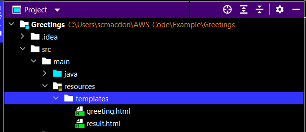
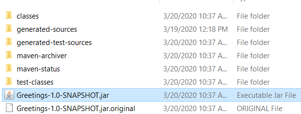
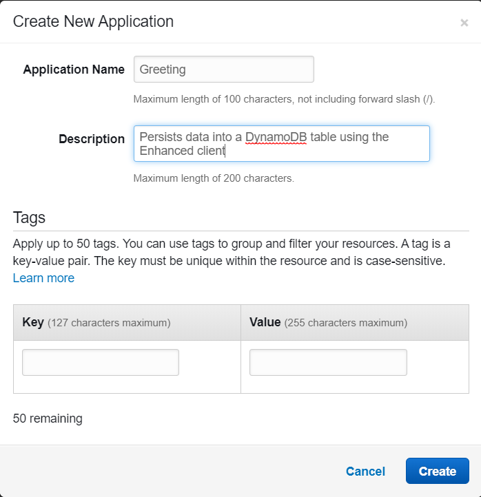

# Creating your first AWS Java web application

## Overview

| Heading      | Description |
| ----------- | ----------- |
| Description | Discusses how to develop a dynamic web MVC application by using the AWS SDK for Java (v2).   |
| Audience   |  Developer (beginner)        |
| Updated   | 5/13/2023        |
| Required skills   | Java, Maven  |

## Purpose

You can develop a dynamic web application that users can use to submit data to an Amazon DynamoDB table. In addition to using DynamoDB, this web application also uses the Amazon Simple Notification Service (Amazon SNS) and AWS Elastic Beanstalk. This application uses the [DynamoDbEnhancedClient](https://sdk.amazonaws.com/java/api/latest/software/amazon/awssdk/enhanced/dynamodb/DynamoDbEnhancedClient.html) to store data in DynamoDB table. After the table is updated, the application uses Amazon SNS to send a text message to notify a user. This application also uses Spring Boot APIs to build a model, views, and a controller.

The DynamoDB enhanced client maps your Java classes to DynamoDB tables. With the DynamoDB enhanced client, you can do the following:

* Access your tables
* Perform various create, read, update, and delete (CRUD) operations
* Execute queries

**Note:** For more information about the DynamoDB enhanced client, see [Map items in DynamoDB tables](https://docs.aws.amazon.com/sdk-for-java/v2/developer-guide/examples-dynamodb-enhanced.html).

The following AWS services are used in this tutorial:

 - Amazon SNS 
 - DynamoDB
 - Elastic Beanstalk

This tutorial guides you through creating an AWS application that uses Spring Boot. After you develop the application, you will learn how to deploy it to Elastic Beanstalk.

**Topics**

+ Prerequisites
+ Understand the web application
+ Create an IntelliJ project
+ Add the POM dependencies
+ Set up the Java package in your project
+ Create the Java classes
+ Create the HTML files
+ Package the application into a .jar file
+ Deploy the application to Elastic Beanstalk

## Prerequisites

To complete the tutorial, you need the following:

+ An AWS account
+ A Java IDE (this example uses IntelliJ)
+ Java 1.8 SDK and Maven

### Important

+ The AWS services included in this document are included in the [AWS Free Tier](https://aws.amazon.com/free/?all-free-tier.sort-by=item.additionalFields.SortRank&all-free-tier.sort-order=asc).
+  This code has not been tested in all AWS Regions. Some AWS services are available only in specific Regions. For more information, see [AWS Regional Services](https://aws.amazon.com/about-aws/global-infrastructure/regional-product-services). 
+ Running this code might result in charges to your AWS account. 
+ Be sure to delete all of the resources that you create while going through this tutorial so that you won't be charged.

### Creating the resources

Create a DynamoDB table named **Greeting** that contains a partition key named **id**. For information about creating a DynamoDB table, see [Create a Table](https://docs.aws.amazon.com/amazondynamodb/latest/developerguide/getting-started-step-1.html). 

In addition, make sure that you have properly set up your development environment. For information, see [Setting up the AWS SDK for Java 2.x](https://docs.aws.amazon.com/sdk-for-java/latest/developer-guide/setup.html).

## Understand the web application

The following shows the application that you will create.


When you choose **Submit**, the data is submitted to a Spring Controller and persisted into a DynamoDB table named **Greeting**. Then, a text message is sent to a user using Amazon SNS. The following is the **Greeting** table.


After the table is updated with a new item, a text message is sent to notify a mobile user.


## Create an IntelliJ project named Greetings
The first step is to create an IntelliJ project.

1. In the IntelliJ IDE, choose **File**, **New**, **Project**.
2. In the **New Project** dialog box, choose **Maven**.
3. Choose **Next**.
4. In **GroupId**, enter **spring-aws**.
5. In **ArtifactId**, enter **Greetings**.
6. Choose **Next**.
7. Choose **Finish**.

## Add the Spring POM dependencies to your project

At this point, you have a new project named **Greetings**.


Make sure that the **pom.xml** file resembles the following XML code.

```xml
	<?xml version="1.0" encoding="UTF-8"?>
<project xmlns="http://maven.apache.org/POM/4.0.0"
         xmlns:xsi="http://www.w3.org/2001/XMLSchema-instance"
         xsi:schemaLocation="http://maven.apache.org/POM/4.0.0 http://maven.apache.org/xsd/maven-4.0.0.xsd">
    <modelVersion>4.0.0</modelVersion>
    <groupId>spring-aws</groupId>
    <artifactId>greetings</artifactId>
    <version>1.0-SNAPSHOT</version>
    <packaging>jar</packaging>
    <description>Demo project for Spring Boot</description>
    <parent>
        <groupId>org.springframework.boot</groupId>
        <artifactId>spring-boot-starter-parent</artifactId>
        <version>2.6.1</version>
        <relativePath/>
    </parent>
    <properties>
        <java.version>1.8</java.version>
    </properties>
    <dependencyManagement>
        <dependencies>
            <dependency>
                <groupId>software.amazon.awssdk</groupId>
                <artifactId>bom</artifactId>
                <version>2.20.45</version>
                <type>pom</type>
                <scope>import</scope>
            </dependency>
        </dependencies>
    </dependencyManagement>
    <dependencies>
        <dependency>
            <groupId>org.springframework.boot</groupId>
            <artifactId>spring-boot-starter-thymeleaf</artifactId>
        </dependency>
        <dependency>
            <groupId>org.springframework.boot</groupId>
            <artifactId>spring-boot-starter-web</artifactId>
        </dependency>
        <dependency>
            <groupId>org.springframework.boot</groupId>
            <artifactId>spring-boot-starter-test</artifactId>
            <scope>test</scope>
            <exclusions>
                <exclusion>
                    <groupId>org.junit.vintage</groupId>
                    <artifactId>junit-vintage-engine</artifactId>
                </exclusion>
            </exclusions>
        </dependency>
        <dependency>
            <groupId>software.amazon.awssdk</groupId>
            <artifactId>dynamodb-enhanced</artifactId>
        </dependency>
        <dependency>
            <groupId>software.amazon.awssdk</groupId>
            <artifactId>dynamodb</artifactId>
        </dependency>
        <dependency>
            <groupId>software.amazon.awssdk</groupId>
            <artifactId>sns</artifactId>
        </dependency>
    </dependencies>
    <build>
        <plugins>
            <plugin>
                <groupId>org.springframework.boot</groupId>
                <artifactId>spring-boot-maven-plugin</artifactId>
                <version>${project.parent.version}</version>
            </plugin>
        </plugins>
    </build>
</project>
```

## Set up the Java packages in your project

In the **main/java** folder, create a Java package named **com.example.handlingformsubmission**. The Java files go into this package.


The following Java files go into this package:

+ **DynamoDBEnhanced** - Stores data in a DynamoDB table by using the DynamoDB enhanced client API.
+ **PublishTextSMS** - Sends a text message by using Amazon SNS.
+ **Greeting** - Represents the model.
+ **GreetingItems** - Uses the **@DynamoDbBean** annotation that's required for the enhanced client.
+ **GreetingController** - Represents the controller.

**Note:** Place the **GreetingApplication** class into the **com.example** package.

## Create the Java classes

Create the main Spring Boot Java class, the Controller class, the Model class, and the AWS service classes.

### Create the main Spring Boot Java class

In the **com.example** package, create a Java class named **GreetingApplication**. Add the following Java code to this class.

```java
	package com.example;

       import org.springframework.boot.SpringApplication;
       import org.springframework.boot.autoconfigure.SpringBootApplication;

       @SpringBootApplication
       public class GreetingApplication {

         public static void main(String[] args) {
          SpringApplication.run(GreetingApplication.class, args);
        }
     }
```

### Create the GreetingController class

In the **com.example.handlingformsubmission** package, create the **GreetingController** class. This class functions as the controller for the Spring Boot application. It handles HTTP requests and returns a view. In this example, notice the **@Autowired** annotation that creates a managed Spring bean. The following Java code represents this class.

```java
	package com.example.handlingformsubmission;

    import org.springframework.beans.factory.annotation.Autowired;
    import org.springframework.stereotype.Controller;
    import org.springframework.ui.Model;
    import org.springframework.web.bind.annotation.GetMapping;
    import org.springframework.web.bind.annotation.ModelAttribute;
    import org.springframework.web.bind.annotation.PostMapping;

    @Controller
    public class GreetingController {
        private final DynamoDBEnhanced dde;
        private final PublishTextSMS msg;

    @Autowired
    GreetingController(
        DynamoDBEnhanced dde,
        PublishTextSMS msg
    ) {
        this.dde = dde;
        this.msg = msg;
    }

    @GetMapping("/")
    public String greetingForm(Model model) {
        model.addAttribute("greeting", new Greeting());
        return "greeting";
    }

    @PostMapping("/greeting")
    public String greetingSubmit(@ModelAttribute Greeting greeting) {
        
        // Persist submitted data into a DynamoDB table.
        dde.injectDynamoItem(greeting);

        // Send a mobile notification.
        msg.sendMessage(greeting.getId());

        return "result";
    }
  }
```

### Create the Greeting class

In the **com.example.handlingformsubmission** package, create the **Greeting** class. This class represents the model for the Spring Boot application. The following Java code represents this class.  

```java
	package com.example.handlingformsubmission;

	public class Greeting {

	private String id;
    	private String body;
    	private String name;
    	private String title;

    	public String getTitle() {
        	return this.title;
    	}

    	public void setTitle(String title) {
        	this.title = title;
    	}

    	public String getName() {
        	return this.name;
    	}

    	public void setName(String name) {
        	this.name = name;
    	}

    	public String getId() {
        	return id;
    	}

    	public void setId(String id) {
        	this.id = id;
    	}

    	public String getBody() {
        	return this.body;
    	}

    	public void setBody(String body) {
        	this.body = body;
    	}
       }
 ```
### Create the GreetingItems class

This class contains the annotation required for the enhanced client. The data members in this class map to the columns in the DynamoDB **Greeting** table.  

```java
  package com.example.handlingformsubmission;

  import software.amazon.awssdk.enhanced.dynamodb.mapper.annotations.DynamoDbBean;
  import software.amazon.awssdk.enhanced.dynamodb.mapper.annotations.DynamoDbPartitionKey;

  @DynamoDbBean
  public class GreetingItems {

    private String id;
    private String name;
    private String message;
    private String title;

    public GreetingItems()
    {
    }

    public String getId() {
        return this.id;
    }

    @DynamoDbPartitionKey
    public void setId(String id) {
        this.id = id;
    }

    public String getName() {
        return this.name;
    }

    public void setName(String name) {
        this.name = name;
    }

    public String getMessage(){
        return this.message;
    }

    public void setMessage(String message){
        this.message = message;
    }

    public String getTitle() {
        return this.title;
    }

    public void setTitle(String title) {
        this.title = title;
    }
  }

```

### Create the DynamoDBEnhanced class

In the **com.example.handlingformsubmission** package, create the **DynamoDBEnhanced** class. This class uses the DynamoDB API that injects data into a DynamoDB table by using the enhanced client. To inject data into a DynamoDB table, create a **DynamoDbTable** object by invoking the **DynamoDbEnhancedClient** object's **table** method and passing the table name (in this example, **Greeting**). Next, create a **GreetingItems** object and populate it with data values that you want to store (in this example, the data items are submitted from the web form).

Create a **PutItemEnhancedRequest** object and pass the **GreetingItems** object for the **items** method. Finally, invoke the **DynamoDbEnhancedClient** object's **putItem** method, and pass the **PutItemEnhancedRequest** object. The following Java code represents the **DynamoDBEnhanced** class.

```java
     package com.example.handlingformsubmission;

    import software.amazon.awssdk.auth.credentials.EnvironmentVariableCredentialsProvider;
    import software.amazon.awssdk.enhanced.dynamodb.DynamoDbEnhancedClient;
    import software.amazon.awssdk.enhanced.dynamodb.DynamoDbTable;
    import software.amazon.awssdk.enhanced.dynamodb.TableSchema;
    import software.amazon.awssdk.enhanced.dynamodb.model.PutItemEnhancedRequest;
    import software.amazon.awssdk.regions.Region;
    import software.amazon.awssdk.services.dynamodb.DynamoDbClient;
    import org.springframework.stereotype.Component;
    import software.amazon.awssdk.services.dynamodb.model.DynamoDbException;

    @Component("DynamoDBEnhanced")
    public class DynamoDBEnhanced {

     public void injectDynamoItem(Greeting item){

        Region region = Region.US_EAST_1;
        DynamoDbClient ddb = DynamoDbClient.builder()
                .region(region)
                .credentialsProvider(EnvironmentVariableCredentialsProvider.create())
                .build();

        try {
            DynamoDbEnhancedClient enhancedClient = DynamoDbEnhancedClient.builder()
                    .dynamoDbClient(ddb)
                    .build();

            DynamoDbTable<GreetingItems> mappedTable = enhancedClient.table("Greeting", TableSchema.fromBean(GreetingItems.class));
            GreetingItems gi = new GreetingItems();
            gi.setName(item.getName());
            gi.setMessage(item.getBody());
            gi.setTitle(item.getTitle());
            gi.setId(item.getId());

            PutItemEnhancedRequest enReq = PutItemEnhancedRequest.builder(GreetingItems.class)
                    .item(gi)
                    .build();

            mappedTable.putItem(enReq);

        } catch (DynamoDbException e) {
            System.err.println(e.getMessage());
            System.exit(1);
        }
     }
   }
```

**Note:** The **EnvironmentVariableCredentialsProvider** is used to create a **DynamoDbClient** because this application will be deployed to Elastic Beanstalk. You can set up environment variables on Elastic Beanstalk so that the  **DynamoDbClient** is successfully created. 	

### Create the PublishTextSMS class

Create a class named **PublishTextSMS** that sends a text message when a new item is added to the DynamoDB table. The following Java code represents this class.

```java
   
   package com.example.handlingformsubmission;

   import software.amazon.awssdk.auth.credentials.EnvironmentVariableCredentialsProvider;
   import software.amazon.awssdk.regions.Region;
   import software.amazon.awssdk.services.sns.SnsClient;
   import software.amazon.awssdk.services.sns.model.PublishRequest;
   import software.amazon.awssdk.services.sns.model.SnsException;
   import org.springframework.stereotype.Component;

   @Component("PublishTextSMS")
   public class PublishTextSMS {

       public void sendMessage(String id) {

          Region region = Region.US_EAST_1;
          SnsClient snsClient = SnsClient.builder()
              .region(region)
              .credentialsProvider(EnvironmentVariableCredentialsProvider.create())
              .build();
        
	      String message = "A new item with ID value "+ id +" was added to the DynamoDB table";
          String phoneNumber="<Enter a valid mobile number>"; // Replace with a mobile phone number.

          try {
              PublishRequest request = PublishRequest.builder()
                  .message(message)
                  .phoneNumber(phoneNumber)
                  .build();

              snsClient.publish(request);

          } catch (SnsException e) {
              System.err.println(e.awsErrorDetails().errorMessage());
              System.exit(1);
          }
        }
    }
```

**Note:** Be sure to specify a valid mobile number for the **phoneNumber** variable.

## Create the HTML files

Under the resource folder, create a **templates** folder, and then create the following HTML files:

+ **greeting.html**
+ **result.html**

The following image shows these files.



Users can submit data to the **GreetingController** by using the form from the **greeting.html** file. This form uses Spring Thymeleaf, which is Java template technology and can be used in Spring Boot applications. With Spring Thymeleaf, you can submit form data as objects to Spring Controllers. For more information, see https://www.thymeleaf.org/.

The **result.html** file is used as a view returned by the controller after the user submits the data. In this example, it displays the **Id** value and the message. By the time the view is displayed, the data is already persisted in the DynamoDB table.

#### Greeting HTML file

The following HTML code represents the **greeting.html** file.

```html
   <!DOCTYPE HTML>
   <html xmlns:th="https://www.thymeleaf.org">
   <head>
     <title>Getting started: Spring Boot and the DynamoDB Enhanced Client</title>
     <meta http-equiv="Content-Type" content="text/html; charset=UTF-8" />
     <link rel="stylesheet" th:href="|https://maxcdn.bootstrapcdn.com/bootstrap/3.3.7/css/bootstrap.min.css|"/>
   </head>
   <body>
    <div class="container">
    <h1>Your first AWS MVC web application</h1>
    <p>You can submit data to an Amazon DynamoDB table by using the DynamoDB Enhanced Client. A mobile notification is sent, alerting a user that a new submission occurred.</p>
    <form action="#" th:action="@{/greeting}" th:object="${greeting}" method="post">
     <div class="form-group">
        <p>Id: <input type="text"  class="form-control" th:field="*{id}" /></p>
        </div>

        <div class="form-group">
            <p>Title: <input type="text" class="form-control" th:field="*{title}" /></p>
        </div>

        <div class="form-group">
            <p>Name: <input type="text" class="form-control" th:field="*{name}" /></p>
        </div>

        <div class="form-group">
            <p>Body: <input type="text" class="form-control" th:field="*{body}"/></p>
        </div>

        <p><input type="submit" value="Submit" /> <input type="reset" value="Reset" /></p>
    </form>
   </div>
   </body>
  </html>
```

**Note:** The **th:field** values correspond to the data members in the **Greeting** class.

#### Result HTML file

The following HTML code represents the **result.html** file.

```html
	<!DOCTYPE HTML>
	<html xmlns:th="https://www.thymeleaf.org">
	<head>
    	 <title>Getting started: Handling form submission</title>
      	  <meta http-equiv="Content-Type" content="text/html; charset=UTF-8" />
	 </head>
	<body>
	<h1>Result</h1>
	<p th:text="'id: ' + ${greeting.id}" />
	<p th:text="'content: ' + ${greeting.body}" />
	<a href="/">Submit another message</a>
	</body>
	</html>
```

## Create a .jar file for the Greetings application

Package up the project into a .jar file that you can deploy to Elastic Beanstalk by using the following Maven command.

	mvn package

The .jar file is located in the target folder, as shown in the following image.



The POM file contains the **spring-boot-maven-plugin**, which builds a executable .jar file that includes the dependencies. (Without the dependencies, the application does not run on Elastic Beanstalk.) For more information, see [Spring Boot Maven Plugin](https://www.baeldung.com/executable-jar-with-maven).

## Deploy the application to Elastic Beanstalk

Deploy the application to Elastic Beanstalk so that it's available from a public URL. Sign in to the AWS Management Console, and then open the Elastic Beanstalk console. An application is the top-level container in Elastic Beanstalk that contains one or more application environments. (For example, prod, qa, dev, prod-web, prod-worker, qa-web, or qa-worker.)

If this is your first time accessing this service, you see the **Welcome to AWS Elastic Beanstalk** page. Otherwise, you see the Elastic Beanstalk dashboard, which lists all of your applications.


**Deploy the Greeting application to Elastic Beanstalk**

1. Open the Elastic Beanstalk console at https://console.aws.amazon.com/elasticbeanstalk/home.
2. Choose **Create New Application**. This opens a wizard that creates your application and launches an appropriate environment.
3. In the **Create New Application** dialog box, enter the following values.
   + **Application Name** - Greeting
   + **Description** - A description for the application



4. Choose **Create one now**.
5. Choose **Web server environment**, and then choose **Select**.
6. In **Preconfigured platform**, choose **Java**.
7. In **Upload your code**, browse to the .jar file that you created.
8. Choose **Create Environment**. You will see the application being created.


9. When you're done, the application states that the **Health** is **Ok**.  


10. To change the port that Spring Boot listens on, add an environment variable named **SERVER_PORT** with the value 5000.
11. Add a variable named **AWS_ACCESS_KEY_ID**, and then specify your access key value.
12. Add a variable named **AWS_SECRET_ACCESS_KEY**, and then specify your secret key value.

**Note:** For more information about setting variables, see [Environment properties and other software settings](https://docs.aws.amazon.com/elasticbeanstalk/latest/dg/environments-cfg-softwaresettings.html).

13. After the variables are configured, you will see the URL for accessing the application.


To access the application, open your browser and enter the full URL.


### Next steps
Congratulations! You have created your first web application that interacts with AWS services. As stated at the beginning of this tutorial, be sure to delete all of the resources that you create while going through this tutorial so that you won't continue to be charged for them.

For more AWS multiservice examples, see
[usecases](https://github.com/awsdocs/aws-doc-sdk-examples/tree/master/javav2/usecases).
