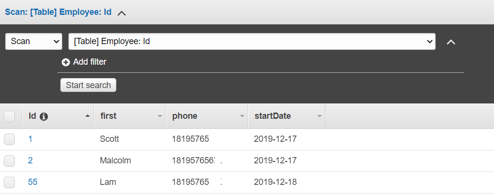

#  Creating scheduled events to invoke Lambda functions

You can create a scheduled event that invokes AWS Lambda functions by using Amazon CloudWatch Events. You can configure CloudWatch Events to use Cron expressions to schedule when a Lambda function is invoked. For example, you can schedule a CloudWatch Event to invoke an AWS Lambda function every weekday. AWS Lambda is a compute service that enables you to run code without provisioning or managing servers.

**Note**: You can create Lambda functions in various programming languages. For this tutorial, Lambda functions are implemented by using the AWS Lambda Java runtime API. For more information about AWS Lambda, see
[What is AWS Lambda](https://docs.aws.amazon.com/lambda/latest/dg/welcome.html).

In this tutorial, you create a Lambda function by using the AWS Lambda Java runtime API. This example invokes different AWS services to perform a specific use case. For example, assume that an organization sends out a mobile text message to its employees that congratulates them at the one year anniversary date, as shown in this illustration.

This tutorial shows you how to use Java logic to create a solution that performs this use case.  For example, you'll learn how to read a database to determine which employees have reached the one year anniversary date, how to process the data, and send out a text message all by using a Lambda function. Then you’ll learn how to use a Cron expression to invoke the Lambda function every weekday. 

This AWS tutorial uses an Amazon DynamoDB table named **Employee** that contains these fields. 
-	**Id** – the key for the table.
-	**first** – the employee’s first name.
-	**phone** – the employee’s phone number.
-	**startDate** – the employee’s start date.

**Cost to complete**: The AWS services included in this document are included in the [AWS Free Tier](https://aws.amazon.com/free/?all-free-tier.sort-by=item.additionalFields.SortRank&all-free-tier.sort-order=asc).

**Note**: Be sure to terminate all of the resources you create while going through this tutorial to ensure that you’re no longer charged.

#### Topics
+	Prerequisites
+	Create an IAM role that is used to execute Lambda functions
+	Create an IntelliJ project named **LambdaCronFunctions**
+	Add the POM dependencies to your project
+	Create Lambda functions by using the AWS Lambda runtime API
+	Package the project that contains the AWS Lambda function
+	Deploy the AWS Lambda function
+	Configure CloudWatch Events to use a Cron expression to invoke the AWS Lambda function

## Prerequisites
To follow along with the tutorial, you need the following:
+ An AWS Account.
+ A Java IDE (for this tutorial, the IntelliJ IDE is used).
+ Java 1.8 JDK.
+ Maven 3.6 or higher.
+ An Amazon DynamoDB table named **Employee** with a key named Id and the fields shown in the previous illustration. Make sure you enter the correct data, including a valid mobile phone that you want to test this use case with. To learn how to create a DynamoDB table, see Create a Table. To learn how to create a DynamoDB table, see [Create a Table](https://docs.aws.amazon.com/amazondynamodb/latest/developerguide/getting-started-step-1.html).

## Create an IAM role that's used to execute Lambda functions

Create the following IAM role:

+ **lambda-support** - Used to invoke Lamdba functions.

This tutorial uses the DynamoDB and Amazon SNS services. The **lambda-support** role has to have policies that enable it to invoke these services from a Lambda function.  

#### To create an IAM role

1. Open the AWS Management Console. When the page loads, enter **IAM** in the search box, and then choose **IAM** to open the IAM console.

2. In the navigation pane, choose **Roles**, and on the **Roles** page, choose **Create Role**.

3. Choose **AWS service**, and then choose **Lambda**.

4. Choose **Permissions**.

5. Search for **AWSLambdaBasicExecutionRole**.

6. Choose **Next Tags**.

7. Choose **Review**.

8. Name the role **lambda-support**.

9. Choose **Create role**.

10. Choose **lambda-support** to view the overview page.

11. Choose **Attach Policies**.

12. Search for **AmazonDynamoDBFullAccess**, and then choose **Attach policy**.

13. Search for **AmazonSNSFullAccess**, and then choose **Attach policy**. When you're done, you can see the permissions.

## Create an IntelliJ project named LambdaCronFunctions

1. In the IntelliJ IDE, choose **File**, **New**, **Project**.

2. In the **New Project** dialog box, choose **Maven**, and then choose **Next**.

3. For **GroupId**, enter **LambdaCronFunctions**.

4. For **ArtifactId**, enter **LambdaCronFunctions**.

5. Choose **Next**.

6. Choose **Finish**.

