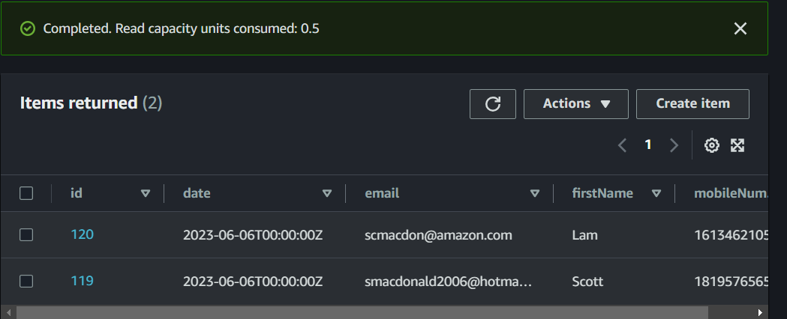
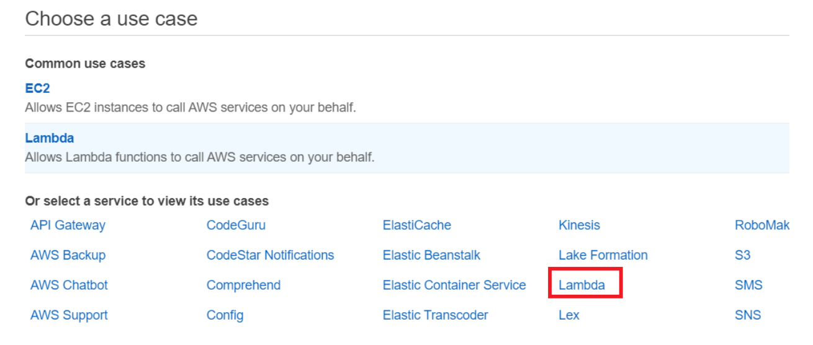
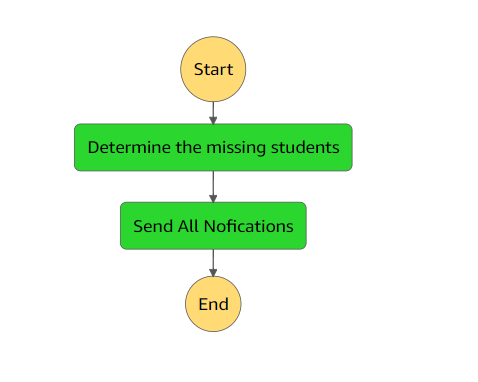
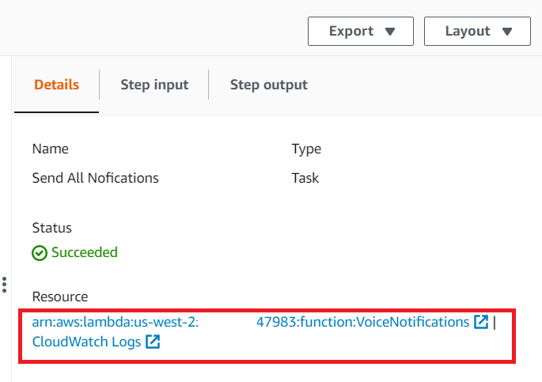

#  Using AWS Step Functions and the AWS SDK for Java to build workflows that send notifications over multiple channels

## Overview

| Heading      | Description |
| ----------- | ----------- |
| Description | Discusses how to develop a workflow with AWS Step Functions to send notifications over multiple channels.|
| Audience   |  Developer (beginner / intermediate)        |
| Updated   | 6/6/2023        |
| Required skills   | Java, Maven  |

## Purpose
You can use Amazon Web Services to create a workflow that sends notifications over multiple channels. There are many practical business needs for this type of functionality. For example, a weather agency might need to warn many people about a storm, or a school might want to send parents alerts when kids are missing. 

The use case for this AWS tutorial assumes that you work at a school and you need to alert parents when a student skips school. Do you send an email message, do you phone the parents, or do you send a text message to a mobile device? The AWS workflow created in this tutorial sends messages over multiple channels, including email, as shown in the following illustration. 


In this AWS tutorial, you create a serverless workflow by using the AWS SDK for Java (v2) and AWS Step Functions. Each workflow step is implemented by using an AWS Lambda function. Lambda is a compute service that you can use to run code without provisioning or managing servers. For more information about Lambda, see
[What is AWS Lambda](https://docs.aws.amazon.com/lambda/latest/dg/welcome.html).

To send notifications over multiple channels, you can use the following AWS services:

+ Amazon Simple Notification Service (Amazon SNS)
+ Amazon Simple Email Service (Amazon SES)

#### Topics

+ Prerequisites
+ Understand the workflow
+ Create an AWS Identity and Access Management (IAM) role 
+ Create a workflow by using AWS Step Functions
+ Create an IntelliJ project 
+ Add the POM dependencies to your project
+ Create Lambda functions by using the Lambda Java API
+ Package the project that contains Lambda functions
+ Deploy Lambda functions
+ Add Lambda functions to workflows
+ Invoke the workflow from the AWS Management Console

## Prerequisites
To use this tutorial, you need the following:

+ An AWS account.
+ A Java IDE. (The IntelliJ IDE is used for this tutorial.)
+ Java 1.8 JDK.
+ Maven 3.6 or later.

### Create an Amazon DynamoDB table

Create an Amazon DynamoDB table named Students. Make sure that this table has these columns: 

+ **id** - The partition key that identifies the student.
+ **date** - A date value that specifies the date when the student was absent.
+ **firstName** - Specifies the student's first name.
+ **mobileNumber** - Specifies the mobile number.
+ **email** - Specifies the email address.

Add a couple of records to ensure that the Workflow works. 



For information on how to create an Amazon DynamoDB table, see [Create a table](https://docs.aws.amazon.com/amazondynamodb/latest/developerguide/getting-started-step-1.html).

### Important

+ The AWS services included in this document are included in the [AWS Free Tier](https://aws.amazon.com/free/?all-free-tier.sort-by=item.additionalFields.SortRank&all-free-tier.sort-order=asc).
+  This code has not been tested in all AWS Regions. Some AWS services are available only in specific Regions. For more information, see [AWS Regional Services](https://aws.amazon.com/about-aws/global-infrastructure/regional-product-services). 
+ Running this code might result in charges to your AWS account. 
+ Be sure to delete all of the resources that you create during this tutorial so that you won't be charged.

## Understand the workflow

The following figure shows the workflow you'll create with this tutorial, which is able to send out multiple messages over multiple channels. 


The following describes each step in the workflow:
+ **Start** - Initiates the workflow and passes in a date value.
+ **Determine the missing students** – Determines the students that are absent for the given day. In this step, an Amazon DynamoDB table is queried to track the students that are absent. This workflow step dynamically creates XML that contains the students and passes the XML to the next step.
+ **Send all notifications** – Parses the XML that contains all absent students. For each student, this step invokes Amazon SNS to send a mobile text message and an email message by using Amazon SES.  
+ **End** - Stops the workflow.

The workflow queries the **students** table to get all absent students, and dynamically creates XML that contains the absent students.  

```xml
       <?xml version="1.0" encoding="UTF-8"?>
       <Students>
         <Student>
          <Name>Sam</Name>
          <Mobile>15558397418</Mobile>
          <Phone>155538397418</Phone>
          <Email>scmacdon@noserver.com</Email>
         </Student>
         <Student>
          <Name>Laurie</Name>
          <Mobile>15554621058</Mobile>
          <Phone>155558397418</Phone>
          <Email>lmccue@cnoserver.com</Email>
         </Student>
       </Students>
```

The second workflow step parses the XML, and for each student, it invokes multiple AWS services to send messages over different channels.   

## Create an IAM role that's used to run Lambda functions

Create the following two IAM roles:

+ **lambda-support** - Used to invoke Lambda functions.
+ **workflow-support** - Used to enable Step Functions to invoke the workflow.

This tutorial uses Amazon SNS, Amazon SES, and Amazon Pinpoint to send messages. The **lambda-support** role has to have policies that enable it to invoke these AWS services from a Lambda function.

#### To create an IAM role

1. Open the AWS Management Console. When the page loads, enter **IAM** in the search box, and then choose **IAM** to open the IAM console.

2. In the navigation pane, choose **Roles**, and on the **Roles** page, choose **Create Role**.

3. Choose **AWS service**, and then choose **Lambda**.



4. Choose **Permissions**.

5. Search for **AWSLambdaBasicExecutionRole**.

6. Choose **Next Tags**.

7. Choose **Review**.

8. Name the role **lambda-support**.


9. Choose **Create role**.

10. Choose **lambda-support** to view the overview page.

11. Choose **Attach Policies**.

12. Search for **AmazonSESFullAccess**, and then choose **Attach policy**.

13. Search for **AmazonSNSFullAccess**, and then choose **Attach policy**. When you're done, you can see the permissions.


**Note**: Repeat this process to create **workflow-support**. For step three, instead of choosing **Lambda**, choose **Step Functions**. You don't need to perform steps 11-13.  

## Create a serverless workflow by using AWS Step Functions

To define a workflow that sends notifications over multiple channels by using AWS Step Functions, create an Amazon States Language (JSON-based) document to define your state machine. An Amazon States Language document describes each step. After you define the document, Step Functions provides a visual representation of the workflow. The following figure shows a visual representation of the workflow.


Workflows can pass data between steps. For example, the **Determine the missing students** step queries the **students** table, dynamically creates XML, and passes XML to the **Send All Notifications** step. 

#### To create a workflow

1. Open the Step Functions console at https://us-west-2.console.aws.amazon.com/states/home.

2. Choose **Create State Machine**.

3. Choose **Write your workflow in code**. In the **Type** area, select **Standard**.


4. Specify the Amazon States Language document by entering the following code.

        {
        "Comment": "A simple Step Functions state machine that sends mass notifications over multiple channels.",
        "StartAt": "Determine the missing students",
        "States": {
         "Determine the missing students": {
         "Type": "Task",
         "Resource": " arn:aws:lambda:REGION:ACCOUNT_ID:function:FUNCTION_NAME ",
         "Next": "Send All Notifications"
         },
        "Send All Notifications": {
         "Type": "Task",
         "Resource": " arn:aws:lambda:REGION:ACCOUNT_ID:function:FUNCTION_NAME ",
         "End": true
         }
        }
       }

**Note:** Don't worry about the errors related to the Lambda resource values. You update these values later in this tutorial.

5. Choose **Next**.

6. In the name field, enter **NotificationsStateMachine**.

7. In the **Permission** section, select **Choose an existing role**.  

8. Choose **workflow-support** (the IAM role that you created).


9. Choose **Create state machine**. A message appears that states the state machine was successfully created.

## Create an IntelliJ project named LambdaNotifications

Create a Java project to develop Lambda functions by using the Lambda Java runtime API. 

1. In the IntelliJ IDE, choose **File**, **New**, **Project**.

2. In the **New Project** dialog box, choose **Maven**, and then choose **Next**.

3. For **GroupId**, enter **LambdaNotifications**.

4. For **ArtifactId**, enter **LambdaNotifications**.

5. Choose **Next**.

6. Choose **Finish**.

## Add the POM dependencies to your project

At this point, you have a new project named **LambdaNotifications**. Add the following code to your project's pom.xml file. 

```xml
       <?xml version="1.0" encoding="UTF-8"?>
<project xmlns="http://maven.apache.org/POM/4.0.0"
         xmlns:xsi="http://www.w3.org/2001/XMLSchema-instance"
         xsi:schemaLocation="http://maven.apache.org/POM/4.0.0 http://maven.apache.org/xsd/maven-4.0.0.xsd">
    <modelVersion>4.0.0</modelVersion>
    <groupId>LambdaNotifications</groupId>
    <artifactId>LambdaNotifications</artifactId>
    <version>1.0-SNAPSHOT</version>
    <packaging>jar</packaging>
    <name>java-basic-function</name>
    <properties>
        <project.build.sourceEncoding>UTF-8</project.build.sourceEncoding>
        <maven.compiler.source>1.8</maven.compiler.source>
        <maven.compiler.target>1.8</maven.compiler.target>
    </properties>
    <dependencyManagement>
        <dependencies>
            <dependency>
                <groupId>software.amazon.awssdk</groupId>
                <artifactId>bom</artifactId>
                <version>2.20.45</version>
                <type>pom</type>
                <scope>import</scope>
            </dependency>
        </dependencies>
    </dependencyManagement>
    <dependencies>
        <dependency>
            <groupId>com.amazonaws</groupId>
            <artifactId>aws-lambda-java-core</artifactId>
            <version>1.2.1</version>
        </dependency>
        <dependency>
            <groupId>software.amazon.awssdk</groupId>
            <artifactId>pinpointsmsvoice</artifactId>
        </dependency>
        <dependency>
            <groupId>software.amazon.awssdk</groupId>
            <artifactId>sns</artifactId>
        </dependency>
        <dependency>
            <groupId>software.amazon.awssdk</groupId>
            <artifactId>pinpoint</artifactId>
        </dependency>
        <dependency>
            <groupId>jakarta.mail</groupId>
            <artifactId>jakarta.mail-api</artifactId>
            <version>2.0.1</version>
        </dependency>
        <dependency>
            <groupId>com.sun.mail</groupId>
            <artifactId>jakarta.mail</artifactId>
            <version>1.6.5</version>
        </dependency>
        <dependency>
            <groupId>org.jdom</groupId>
            <artifactId>jdom</artifactId>
            <version>2.0.2</version>
        </dependency>
        <dependency>
            <groupId>org.slf4j</groupId>
            <artifactId>slf4j-log4j12</artifactId>
            <version>1.7.36</version>
        </dependency>
        <dependency>
            <groupId>software.amazon.awssdk</groupId>
            <artifactId>dynamodb</artifactId>
        </dependency>
        <dependency>
            <groupId>software.amazon.awssdk</groupId>
            <artifactId>dynamodb-enhanced</artifactId>
        </dependency>
        <dependency>
            <groupId>software.amazon.awssdk</groupId>
            <artifactId>ses</artifactId>
        </dependency>
           <dependency>
            <groupId>org.apache.logging.log4j</groupId>
            <artifactId>log4j-api</artifactId>
            <version>2.17.2</version>
        </dependency>
        <dependency>
            <groupId>org.apache.logging.log4j</groupId>
            <artifactId>log4j-core</artifactId>
            <version>2.17.2</version>
            <scope>test</scope>
        </dependency>
        <dependency>
            <groupId>org.apache.logging.log4j</groupId>
            <artifactId>log4j-slf4j18-impl</artifactId>
            <version>2.17.2</version>
            <scope>test</scope>
        </dependency>
        <dependency>
            <groupId>org.junit.jupiter</groupId>
            <artifactId>junit-jupiter-api</artifactId>
            <version>5.8.2</version>
            <scope>test</scope>
        </dependency>
        <dependency>
            <groupId>org.apache.commons</groupId>
            <artifactId>commons-text</artifactId>
            <version>1.10.0</version>
        </dependency>
        <dependency>
            <groupId>org.junit.jupiter</groupId>
            <artifactId>junit-jupiter-engine</artifactId>
            <version>5.6.0</version>
            <scope>test</scope>
        </dependency>
      </dependencies>
    <build>
        <plugins>
            <plugin>
                <artifactId>maven-surefire-plugin</artifactId>
                <version>2.22.2</version>
            </plugin>
            <plugin>
                <groupId>org.apache.maven.plugins</groupId>
                <artifactId>maven-shade-plugin</artifactId>
                <version>3.2.2</version>
                <configuration>
                    <createDependencyReducedPom>false</createDependencyReducedPom>
                </configuration>
                <executions>
                    <execution>
                        <phase>package</phase>
                        <goals>
                            <goal>shade</goal>
                        </goals>
                    </execution>
                </executions>
            </plugin>
            <plugin>
                <groupId>org.apache.maven.plugins</groupId>
                <artifactId>maven-compiler-plugin</artifactId>
                <version>3.8.1</version>
                <configuration>
                    <source>1.8</source>
                    <target>1.8</target>
                </configuration>
            </plugin>
        </plugins>
    </build>
</project>
```

## Create Lambda functions by using the AWS SDK for Java

Use the Lambda runtime API to create the Java classes that define the Lambda functions. In this example, there are two workflow steps that each correspond to a Java class. There are also extra classes that invoke the AWS services. All Java classes are located in a package named **com.example**.

To create a Lambda function by using the Lambda runtime API, implement **com.amazonaws.services.lambda.runtime.RequestHandler**. The application logic that's executed when the workflow step is invoked is located in the **handleRequest** method. The return value of this method is passed to the next step in a workflow.

Create these Java classes, which are described in the following sections:
+ **StudentData** - Used for the Amazon DynamoDB Enhanced client.  
+ **ListMissingStudentsHandler** - Used as the first step in the workflow. This class queries data from the Amazon DynamoDB table. 
+ **ChannelHandler** - Used as the second step in the workflow. Sends out messages over multiple channels.
+ **GetStudents** - Queries data from the **Students** table using the Amazon DynamoDB Java API (v2). 
+ **SendNotifications** - Uses the AWS SDK for Java (v2) to invoke the Amazon SNS and Amazon SES services.
+ **Student** - A Java class that defines data members to store student data. 

### StudentData class

The following Java code represents the **StudentData** class. This class contains the annotations, such as **@DynamoDbBean** required for the enhanced client. 

```java
package com.example;

import software.amazon.awssdk.enhanced.dynamodb.mapper.annotations.DynamoDbBean;
import software.amazon.awssdk.enhanced.dynamodb.mapper.annotations.DynamoDbPartitionKey;
import java.time.Instant;

@DynamoDbBean
public class StudentData {
    private String id;

    private String firstName;

    private String email;
    private String mobileNumber ;

    private Instant date;

    public Instant getDate() {
        return this.date;
    }

    public void setDate(Instant date) {
        this.date = date;
    }
    @DynamoDbPartitionKey
    public String getId() {
        return this.id;
    }

    public void setId(String id) {
      this.id = id;
    }

    public void setMobileNumber(String mobileNumber) {
        this.mobileNumber = mobileNumber;
    }

    public String getMobileNumber() {
        return this.mobileNumber;
    }

    public void setEmail(String email) {
        this.email = email;
    }

    public String getEmail() {
        return this.email;
    }

    public void setFirstName(String firstName) {
        this.firstName = firstName;
    }

    public String getFirstName() {
        return this.firstName;
    }
}

```

### ListMissingStudentsHandler class

This Java code represents the **ListMissingStudentsHandler** class. The class creates a Lambda function that reads the passed in date value and queries the **Students** table using this value.  The **handleRequest** method returns XML that specifies all of the absent students. The XML is passed to the second step in the workflow.

```java
 package com.example;

import com.amazonaws.services.lambda.runtime.Context;
import com.amazonaws.services.lambda.runtime.RequestHandler;
import com.amazonaws.services.lambda.runtime.LambdaLogger;
import java.util.Map;

public class ListMissingStudentsHandler implements RequestHandler<Map<String,String>, String> {

    @Override
    public String handleRequest(Map<String,String> event, Context context) {
        LambdaLogger logger = context.getLogger();
        String date = event.get("date");
        logger.log("DATE: " + date);

        GetStudents students = new GetStudents();
        String xml = students.getStudentsData(date);
        logger.log("XML: " + xml);
        return xml;
    }
}
 ```

### ChannelHandler class

The **ChannelHandler** class is the second step in the workflow. It creates a **SendNotifications** object and passes the XML to the following methods: 

+ **handleTextMessage** 
+ **handleEmailMessage**

The following code represents the **ChannelHandler** method. In this example, the XML that is passed to the from the first workflow step is stored in the **xml** variable. 

```java
package com.example;

import com.amazonaws.services.lambda.runtime.Context;
import com.amazonaws.services.lambda.runtime.RequestHandler;
import com.amazonaws.services.lambda.runtime.LambdaLogger;
import org.jdom2.JDOMException;
import javax.mail.MessagingException;
import java.io.IOException;

public class ChannelHandler implements RequestHandler<String, String> {
    @Override
    public String handleRequest(String event, Context context) {
        LambdaLogger logger = context.getLogger();
        String xml = event;
        int num =0;
        SendNotifications sn = new SendNotifications();
        try {
           sn.handleTextMessage(xml);
           num = sn.handleEmailMessage(xml);
           logger.log("The workflow sent "+num +" email messages");
        } catch (JDOMException | IOException | MessagingException e) {
            e.printStackTrace();
        }
        return "The workflow sent "+num +" email messages";
    }
}

 ```

### GetStudents class

The **GetStudents** class uses the Amazon DynamoDB Java API to query data from the **Students** table. The result set is stored in XML which is passed to the second step in the worlkflow. 

```java
package com.example;

import org.w3c.dom.Document;
import org.w3c.dom.Element;
import software.amazon.awssdk.enhanced.dynamodb.DynamoDbEnhancedClient;
import software.amazon.awssdk.enhanced.dynamodb.DynamoDbTable;
import software.amazon.awssdk.enhanced.dynamodb.Expression;
import software.amazon.awssdk.enhanced.dynamodb.TableSchema;
import software.amazon.awssdk.enhanced.dynamodb.model.ScanEnhancedRequest;
import software.amazon.awssdk.regions.Region;
import software.amazon.awssdk.services.dynamodb.DynamoDbClient;
import software.amazon.awssdk.services.dynamodb.model.AttributeValue;
import javax.xml.parsers.DocumentBuilder;
import javax.xml.parsers.DocumentBuilderFactory;
import javax.xml.parsers.ParserConfigurationException;
import javax.xml.transform.OutputKeys;
import javax.xml.transform.Transformer;
import javax.xml.transform.TransformerException;
import javax.xml.transform.TransformerFactory;
import javax.xml.transform.dom.DOMSource;
import javax.xml.transform.stream.StreamResult;
import java.io.StringWriter;
import java.util.ArrayList;
import java.util.HashMap;
import java.util.List;
import java.util.Map;

public class GetStudents {

    private DynamoDbClient getDynamoDBClient() {
        Region region = Region.US_WEST_2;
        return DynamoDbClient.builder()
            .region(region)
            .build();
    }

    public String getStudentsData(String date) {
        DynamoDbClient ddbClient = getDynamoDBClient();
        DynamoDbEnhancedClient enhancedClient = DynamoDbEnhancedClient.builder()
            .dynamoDbClient(ddbClient)
            .build();

        DynamoDbTable<StudentData> table = enhancedClient.table("Students", TableSchema.fromBean(StudentData.class));
        AttributeValue attr = AttributeValue.builder()
            .s(date)
            .build();

        Map<String, AttributeValue> myMap = new HashMap<>();
        myMap.put(":val1",attr);

        Map<String, String> myExMap = new HashMap<>();
        myExMap.put("#mydate", "date");

        // Set the Expression so only active items are queried from the Work table.
        Expression expression = Expression.builder()
            .expressionValues(myMap)
            .expressionNames(myExMap)
            .expression("#mydate = :val1")
            .build();

        ScanEnhancedRequest enhancedRequest = ScanEnhancedRequest.builder()
            .filterExpression(expression)
            .limit(15)
            .build();

        List<Student> studentList = new ArrayList<>();
        for (StudentData singleStudent : table.scan(enhancedRequest).items()) {
            Student student = new Student();
            student.setFirstName(singleStudent.getFirstName());
            student.setMobileNumber(singleStudent.getMobileNumber());
            student.setEmail(singleStudent.getEmail());

            // Push the Student object to the list.
            studentList.add(student);
        }
        return convertToString(toXml(studentList));
    }

    private String convertToString(Document xmlDocument) {
        try {
            TransformerFactory tf = TransformerFactory.newInstance();
            Transformer transformer;
            transformer = tf.newTransformer();
            transformer.setOutputProperty(OutputKeys.OMIT_XML_DECLARATION, "yes");

            // A character stream that collects its output in a string buffer,
            // which can then be used to construct a string.
            StringWriter writer = new StringWriter();

            // Transform document to string.
            transformer.transform(new DOMSource(xmlDocument), new StreamResult(writer));
            return writer.getBuffer().toString();

        } catch (TransformerException ex) {
            ex.printStackTrace();
        }
        return null;
    }

    // Convert the list to XML.
    private Document toXml(List<Student> itemList) {
        try {
            DocumentBuilderFactory factory = DocumentBuilderFactory.newInstance();
            factory.setFeature("http://apache.org/xml/features/disallow-doctype-decl", true);
            DocumentBuilder builder = factory.newDocumentBuilder();
            Document doc = builder.newDocument();

            // Start building the XML.
            Element root = doc.createElement( "Students" );
            doc.appendChild( root );

            // Loop through the list.
            for (Student myStudent: itemList) {
                Element item = doc.createElement( "Student" );
                root.appendChild( item );

                // Set Name.
                Element name = doc.createElement( "Name" );
                name.appendChild( doc.createTextNode(myStudent.getFirstName()) );
                item.appendChild( name );

                // Set Mobile.
                Element mobile = doc.createElement( "Mobile" );
                mobile.appendChild( doc.createTextNode(myStudent.getMobileNumber()) );
                item.appendChild( mobile );

                // Set Email.
                Element email = doc.createElement( "Email" );
                email.appendChild( doc.createTextNode(myStudent.getEmail() ) );
                item.appendChild( email );
            }

         return doc;
        } catch(ParserConfigurationException e) {
            e.printStackTrace();
        }
        return null;
    }
}

```

### SendNotifications class

The **SendNotifications** class uses the Amazon SES API and the Amazon SNS API to send messages. Each student in the XML is sent a message. 

```java
package com.example;

import org.jdom2.Document;
import org.jdom2.JDOMException;
import org.jdom2.input.SAXBuilder;
import org.xml.sax.InputSource;
import software.amazon.awssdk.regions.Region;
import software.amazon.awssdk.services.ses.model.Body;
import software.amazon.awssdk.services.ses.model.Content;
import software.amazon.awssdk.services.ses.model.Destination;
import software.amazon.awssdk.services.ses.model.SendEmailRequest;
import software.amazon.awssdk.services.sns.SnsClient;
import software.amazon.awssdk.services.sns.model.PublishRequest;
import software.amazon.awssdk.services.sns.model.SnsException;
import software.amazon.awssdk.services.ses.SesClient;
import software.amazon.awssdk.services.ses.model.SesException;
import javax.mail.MessagingException;
import java.util.List;
import java.io.IOException;
import java.io.StringReader;

public class SendNotifications {
    public int handleEmailMessage(String myDom) throws JDOMException, IOException, MessagingException {
        String myEmail;
        String name ;
        SesClient client = SesClient.builder()
                .region(Region.US_WEST_2)
                .build();

        SAXBuilder builder = new SAXBuilder();
        builder.setFeature("http://apache.org/xml/features/disallow-doctype-decl", true);
        Document jdomDocument = builder.build(new InputSource(new StringReader(myDom)));
        org.jdom2.Element root = jdomDocument.getRootElement();

        // Get the list of children elements.
        int countStudents = 0;
        List<org.jdom2.Element> students = root.getChildren("Student");
        for (org.jdom2.Element element : students) {
            myEmail = element.getChildText("Email");
            name = element.getChildText("Name");
            sendEmail(client, myEmail, name);
            countStudents++;
        }
        client.close();
        return countStudents;
    }

    public void handleTextMessage(String myDom) throws JDOMException, IOException{
        String mobileNum;
        String name ;
        SnsClient snsClient = SnsClient.builder()
                .region(Region.US_EAST_1)
                .build();

        SAXBuilder builder = new SAXBuilder();
        builder.setFeature("http://apache.org/xml/features/disallow-doctype-decl", true);
        Document jdomDocument = builder.build(new InputSource(new StringReader(myDom)));
        org.jdom2.Element root = jdomDocument.getRootElement();

        // get the list of children agent elements.
        List<org.jdom2.Element> students = root.getChildren("Student");
        for (org.jdom2.Element element : students) {
            mobileNum = element.getChildText("Mobile");
            name = element.getChildText("Name");
            publishTextSMS(snsClient, mobileNum, name);
        }
        snsClient.close();
    }

    private void publishTextSMS(SnsClient snsClient, String phoneNumber, String name) {
        String message = "Please be advised that "+name + " was marked absent from school today.";
        try {
            PublishRequest request = PublishRequest.builder()
                    .message(message)
                    .phoneNumber(phoneNumber)
                    .build();

            snsClient.publish(request);

        } catch (SnsException e) {
            System.err.println(e.awsErrorDetails().errorMessage());
            System.exit(1);
        }
    }

    public void sendEmail(SesClient client, String recipient, String name) {
             // The HTML body of the email.
            String bodyHTML = "<html>" + "<head></head>" + "<body>" + "<h1>Hello!</h1>"
                    + "<p>Please be advised that "+name +" was marked absent from school today.</p>" + "</body>" + "</html>";

            String sender = "<Enter your email address>";
            String subject = "School Attendance";

            Destination destination = Destination.builder()
                    .toAddresses(recipient)
                    .build();

            Content content = Content.builder()
                    .data(bodyHTML)
                    .build();

            Content sub = Content.builder()
                    .data(subject)
                    .build();

            Body body = Body.builder()
                    .html(content)
                    .build();

            software.amazon.awssdk.services.ses.model.Message msg = software.amazon.awssdk.services.ses.model.Message.builder()
                    .subject(sub)
                    .body(body)
                    .build();

            SendEmailRequest emailRequest = SendEmailRequest.builder()
                    .destination(destination)
                    .message(msg)
                    .source(sender)
                    .build();

            try {
                System.out.println("Attempting to send an email through Amazon SES " + "using the AWS SDK for Java...");
                client.sendEmail(emailRequest);

            } catch (SesException e) {
                System.err.println(e.awsErrorDetails().errorMessage());
                System.exit(1);
            }
        }
    }


```

**NOTE** You need to specify a valid email for the sender that has been validated. For information, see [Verifying an email address](https://docs.aws.amazon.com/ses/latest/DeveloperGuide//verify-email-addresses-procedure.html).  

### Student class

The following Java class represents the **Student** class. 

```java
     package com.example;

public class Student {

    private String firstName;
    private String email;
    private String mobileNumber ;

    public void setMobileNumber(String mobileNumber) {
        this.mobileNumber = mobileNumber;
    }

    public String getMobileNumber() {
        return this.mobileNumber;
    }

    public void setEmail(String email) {
        this.email = email;
    }

    public String getEmail() {
        return this.email;
    }

    public void setFirstName(String firstName) {
        this.firstName = firstName;
    }

    public String getFirstName() {
        return this.firstName;
    }
}

```
## Package the project that contains the Lambda functions

Package up the project into a .jar (JAR) file that you can deploy as a Lambda function by using the following Maven command.

    mvn package

The JAR file is located in the **target** folder (which is a child folder of the project folder).


## Deploy the Lambda functions

1. Open the Lambda console at https://us-west-2.console.aws.amazon.com/lambda/home.

2. Choose **Create Function**.

3. Choose **Author from scratch**.

4. In the **Basic** information section, enter **School** as the name.

5. In the **Runtime**, choose **Java 8**.

6. Choose **Use an existing role**, and then choose **lambda-support** (the IAM role that you created).

7. Choose **Create function**.

8. For **Code entry type**, choose **Upload a .zip or .jar file**.

9. Choose **Upload**, and then browse to the JAR file that you created.  

10. For **Handler**, enter the fully qualified name of the function, for example, **com.example.ListMissingStudentsHandler::handleRequest** (**com.example** specifies the package, followed by class and finally followed by :: and method name).

11. Choose **Save.**

12. Test your Lambda function. Pass in the JSON data that contains the date to query ("date": "2021-02-01"). When successful, you see XML that contains the data queried from the database.  


**Note** Repeat this procedure for the **ChannelHandler** class. Name the corresponding Lambda function **myMultiChannel**. When you finish, you will have two Lambda functions that you can reference in the Amazon States Language document.  

## Add the Lambda functions to workflows

Open the Lambda console. You can view the Lambda Amazon Resource Name (ARN) value in the upper-right corner.


Copy the Lambda ARN value. Then, open the Step Functions console. In the **Determine the missing students** step of the Amazon States Language document, paste the Lambda ARN value. Also, update the Lambda ARN value for the **Send All Notifications** step. This is how you hook in Lambda functions created by using the SDK for Java into a workflow created by using Step Functions.


## Execute your workflow by using the Step Functions console

You can invoke the workflow on the Step Functions console. An execution receives JSON input. For this example, you can pass the following JSON data to the workflow.  

{
  "date": "2023-06-06T00:00:00Z"
}

**Note**: Change the date value to match the date values in the **Students** table. Otherwise, you will receive an empty result set. 

#### To execute your workflow

1. On the Step Functions console, choose **Start execution**.

2. In the **Input** section, pass the JSON data. As each step is completed, it turns green.




If the step turns red, an error occurred. You can choose the step and view the logs that are accessible from the right side.




### Next steps
Congratulations, you have created an AWS serverless workflow that sends messages over multiple channels. As stated at the beginning of this tutorial, be sure to delete all of the resources you created during this tutorial so that you won't be charged.

For more AWS multiservice examples, see
[usecases](https://github.com/awsdocs/aws-doc-sdk-examples/tree/master/javav2/usecases).

